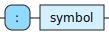
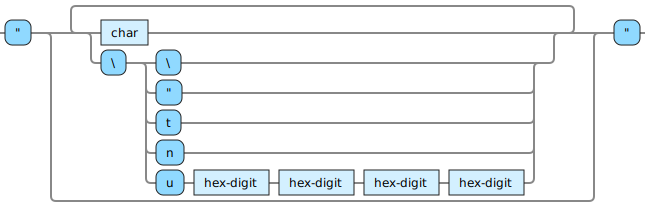
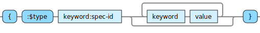

<!---
  This markdown file was generated. Do not edit.
  -->

# Halite basic syntax reference

### <a name="non-numeric-character"></a>non-numeric-character


---
### <a name="plus-minus-character"></a>plus-minus-character


---
### <a name="symbol-character"></a>symbol-character


---
### <a name="simple-symbol"></a>simple-symbol


!["plus-minus-character | ((non-numeric-character | plus-minus-character) [{symbol-character}])"](./halite-bnf-diagrams/basic-syntax/simple-symbol.svg)

---
### <a name="symbol"></a>symbol

Symbols are identifiers that allow values and operations to be named. The following are reserved and cannot be used as user defined symbols: true, false, nil.

!["simple-symbol [ '/' simple-symbol]"](./halite-bnf-diagrams/basic-syntax/symbol.svg)

Symbols are used to identify operators, variables in expressions, and specifications. Symbols are not values. There are no expressions that produce symbols. Anywhere that a symbol is called for in an operator argument list, a literal symbol must be provided. Symbols passed as arguments to operators are not evaluated. Symbols used within expressions in general are evaluated prior to invoking the operator. A common pattern in operator arguments is to provide a sequence of alternating symbols and values within square brackets. In these cases each symbol is bound to the corresponding value in pair-wise fashion.

<table><tr><td colspan="1">

```clojure
a
```

</td><td colspan="1">

```clojure
a.b
```

</td><td colspan="1">

```clojure
a/b
```

</td></tr></table>

---
### <a name="keyword"></a>keyword

Keywords are identifiers that are used for instance field names. The following are reserved and cannot be used as user defined keywords: :true, :false, :nil.



Keywords are not values. There are no expressions that produce keywords. Anywhere that a keyword is called for in an operator arugment list, a literal keyword must be provided. Keywords themselves cannot be evaluated.  

<table><tr><td colspan="1">

```clojure
:age
```

</td><td colspan="1">

```clojure
:x/y
```

</td></tr></table>

---
### <a name="boolean"></a>boolean


---
### <a name="string"></a>string

Strings are sequences of characters. Strings can be multi-line. Quotation marks can be included if escaped with a \. A backslash can be included with the character sequence: \\ . Strings can include special characters, e.g. \t for a tab and \n for a newline, as well as unicode via \uNNNN. Unicode can also be directly entered in strings. Additional character representations may work but the only representations that are guaranteed to work are those documented here.



<table><tr><td colspan="1">

```clojure
""
```

</td><td colspan="1">

```clojure
"hello"
```

</td><td colspan="1">

```clojure
"say \"hi\" now"

;-- result --;
"say \"hi\" now"
```

</td><td colspan="1">

```clojure
"one \\ two"

;-- result --;
"one \\ two"
```

</td><td colspan="1">

```clojure
"\t\n"

;-- result --;
"\t\n"
```

</td></tr><tr><td colspan="1">

```clojure
"☺"

;-- result --;
"☺"
```

</td><td colspan="1">

```clojure
"\u263A"

;-- result --;
"☺"
```

</td></tr></table>

---
### <a name="integer"></a>integer

Signed numeric integer values with no decimal places. Alternative integer representations may work, but the only representation that is guaranteed to work on an ongoing basis is that documented here.

!["[plus-minus-character] '0-9' {'0-9'}"](./halite-bnf-diagrams/basic-syntax/integer.svg)

<table><tr><td colspan="1">

```clojure
0
```

</td><td colspan="1">

```clojure
1
```

</td><td colspan="1">

```clojure
+1
```

</td><td colspan="1">

```clojure
-1
```

</td><td colspan="1">

```clojure
9223372036854775807
```

</td></tr><tr><td colspan="1">

```clojure
-9223372036854775808
```

</td></tr></table>

---
### <a name="fixed-decimal"></a>fixed-decimal

Signed numeric values with decimal places.

!["'#' 'd' [whitespace] '\"' ['-'] ('0' | ('1-9' {'0-9'})) '.' '0-9' {'0-9'} '\"'"](./halite-bnf-diagrams/basic-syntax/fixed-decimal.svg)

<table><tr><td colspan="1">

```clojure
#d "1.1"
```

</td><td colspan="1">

```clojure
#d "-1.1"
```

</td><td colspan="1">

```clojure
#d "1.00"
```

</td><td colspan="1">

```clojure
#d "0.00"
```

</td></tr></table>

---
### <a name="instance"></a>instance

Represents an instance of a specification.



The contents of the instance are specified in pair-wise fashion with alternating field names and field values. The special field name ':$type' is mandatory but cannot be used as the other fields are. 

<table><tr><td colspan="2">

```clojure
{:$type :text/Spec$v1 :x 1 :y -1}
```

</td></tr></table>

---
### <a name="vector"></a>vector

A collection of values in a prescribed sequence.

!["'[' [whitespace] { value whitespace} [value] [whitespace] ']'"](./halite-bnf-diagrams/basic-syntax/vector.svg)

<table><tr><td colspan="1">

```clojure
[]
```

</td><td colspan="1">

```clojure
[1 2 3]
```

</td></tr></table>

---
### <a name="set"></a>set

A collection of values in an unordered set. Duplicates are not allowed.

!["'#' '{' [whitespace] { value [whitespace]} [value] [whitespace] '}'"](./halite-bnf-diagrams/basic-syntax/set.svg)

The members of sets are not directly accessible. If it is necessary to access the members of a set, it is recommended to design the data structures going into the sets in such a way that the set can be sorted into a vector for access.  

<table><tr><td colspan="1">

```clojure
#{}
```

</td><td colspan="1">

```clojure
#{1 2 3}
```

</td></tr></table>

---
### <a name="value"></a>value

Expressions and many literals produce values.


---
### <a name="any"></a>any

Refers to either the presence of absence of a value.


---
