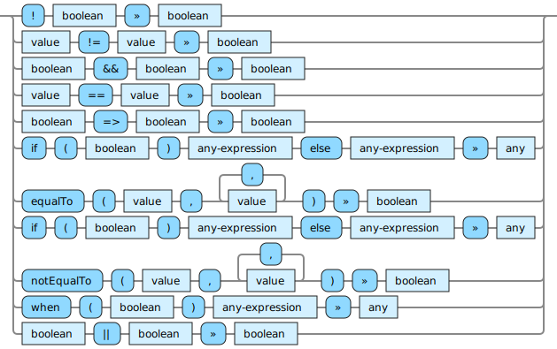

<!---
  This markdown file was generated. Do not edit.
  -->

# Jadeite boolean-op reference

### boolean-op

Operations that operate on boolean values.

#### [`=>`](jadeite-full-reference.md#_E_G)

Performs logical implication. If the first value is true, then the second value must also be true for the result to be true. If the first value is false, then the result is true.

#### [`&&`](jadeite-full-reference.md#&&)

Perform a logical 'and' operation on the input values.

#### [`if`](jadeite-full-reference.md#if)

If the first argument is true, then evaluate the second argument, otherwise evaluate the third argument.

#### [`!`](jadeite-full-reference.md#_B)

Performs logical negation of the argument.

#### [`notEqualTo`](jadeite-full-reference.md#notEqualTo)

Produces a false value if all of the values are equal to each other. Otherwise produces a true value.

#### [`||`](jadeite-full-reference.md#||)

Perform a logical 'or' operation on the input values.

#### [`when`](jadeite-full-reference.md#when)

If the first argument is true, then evaluate the second argument, otherwise produce 'unset'.

---
