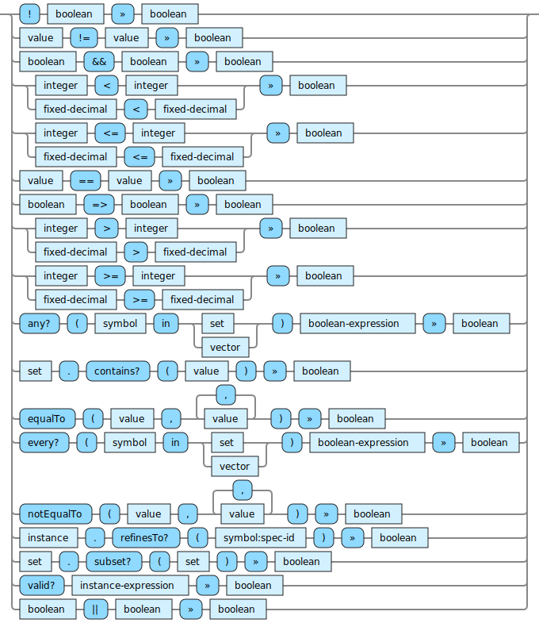

<!---
  This markdown file was generated. Do not edit.
  -->

# Jadeite reference: Produce booleans

### Operations that produce boolean output values.

For basic syntax of this data type see: [`boolean`](jadeite-basic-syntax-reference.md#boolean)

#### [`!`](jadeite-full-reference.md#_B)

Performs logical negation of the argument.

#### [`&&`](jadeite-full-reference.md#&&)

Perform a logical 'and' operation on the input values.

#### [`<`](jadeite-full-reference.md#_L)

Determine if a number is strictly less than another.

#### [`<=`](jadeite-full-reference.md#_L_E)

Determine if a number is less than or equal to another.

#### [`=>`](jadeite-full-reference.md#_E_G)

Performs logical implication. If the first value is true, then the second value must also be true for the result to be true. If the first value is false, then the result is true.

#### [`>`](jadeite-full-reference.md#_G)

Determine if a number is strictly greater than another.

#### [`>=`](jadeite-full-reference.md#_G_E)

Determine if a number is greater than or equal to another.

#### [`any?`](jadeite-full-reference.md#any_Q)

Evaluates to true if the boolean-expression is true when the symbol is bound to some element in the collection.

#### [`contains?`](jadeite-full-reference.md#contains_Q)

Determine if a specific value is in a set.

#### [`equalTo`](jadeite-full-reference.md#equalTo)

Determine if two values are equivalent. For vectors and sets this performs a comparison of their contents.

#### [`every?`](jadeite-full-reference.md#every_Q)

Evaluates to true if the boolean-expression is true when the symbol is bound to each the element in the collection.

#### [`notEqualTo`](jadeite-full-reference.md#notEqualTo)

Produces a false value if all of the values are equal to each other. Otherwise produces a true value.

#### [`refinesTo?`](jadeite-full-reference.md#refinesTo_Q)

Determine whether it is possible to refine the given instance into an instance of type, spec-id.

#### [`subset?`](jadeite-full-reference.md#subset_Q)

Return false if there are any items in the first set which do not appear in the second set. Otherwise return true.

#### [`valid?`](jadeite-full-reference.md#valid_Q)

Evaluate the instance expression and produce false if a constraint violation occurs during the evaluation. Otherwise, produce true.

#### [`||`](jadeite-full-reference.md#||)

Perform a logical 'or' operation on the input values.

---
