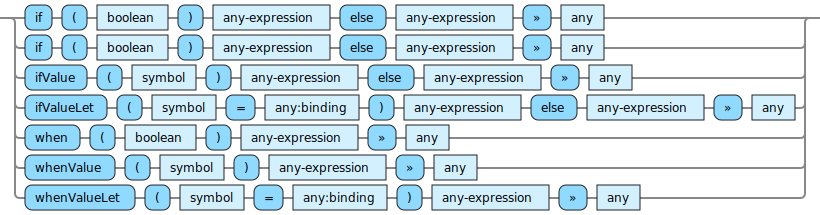

<!---
  This markdown file was generated. Do not edit.
  -->

# Jadeite reference: Control flow

### Operators that control the flow of execution of the code.

#### [`if`](jadeite-full-reference.md#if)

If the first argument is true, then evaluate the second argument, otherwise evaluate the third argument.

#### [`ifValue`](jadeite-full-reference.md#ifValue)

Consider the value bound to the symbol. If it is a 'value', then evaluate the second argument. If instead it is 'unset' then evaluate the third argument.

#### [`ifValueLet`](jadeite-full-reference.md#ifValueLet)

If the binding value is a 'value' then evaluate the second argument with the symbol bound to binding. If instead, the binding value is 'unset', then evaluate the third argument without introducing a new binding for the symbol.

#### [`when`](jadeite-full-reference.md#when)

If the first argument is true, then evaluate the second argument, otherwise produce 'unset'.

#### [`whenValue`](jadeite-full-reference.md#whenValue)

Consider the value bound to the symbol. If it is a 'value', then evaluate the second argument. If instead it is 'unset' then produce unset.

#### [`whenValueLet`](jadeite-full-reference.md#whenValueLet)

If the binding value is a 'value' then evaluate the second argument with the symbol bound to binding. If instead, the binding value is 'unset', then produce 'unset'

---
