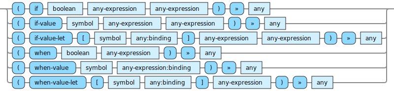

<!---
  This markdown file was generated. Do not edit.
  -->

# Halite control-flow reference

### control-flow

Operators that control the flow of execution of the code.

#### [`if`](halite-full-reference.md#if)

If the first argument is true, then evaluate the second argument, otherwise evaluate the third argument.

#### [`if-value`](halite-full-reference.md#if-value)

Consider the value bound to the symbol. If it is a 'value', then evaluate the second argument. If instead it is 'unset' then evaluate the third argument.

#### [`if-value-let`](halite-full-reference.md#if-value-let)

If the binding value is a 'value' then evaluate the second argument with the symbol bound to binding. If instead, the binding value is 'unset', then evaluate the third argument without introducing a new binding for the symbol.

#### [`when`](halite-full-reference.md#when)

If the first argument is true, then evaluate the second argument, otherwise produce 'unset'.

#### [`when-value`](halite-full-reference.md#when-value)

Consider the value bound to the symbol. If it is a 'value', then evaluate the second argument. If instead it is 'unset' then produce unset.

#### [`when-value-let`](halite-full-reference.md#when-value-let)

If the binding value is a 'value' then evaluate the second argument with the symbol bound to binding. If instead, the binding value is 'unset', then produce 'unset'

---
