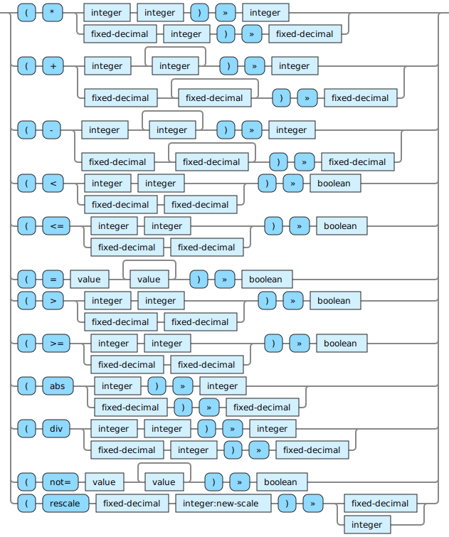

<!---
  This markdown file was generated. Do not edit.
  -->

# Halite fixed-decimal-op reference

### fixed-decimal-op

Operations that operate on fixed-decimal values.

For basic syntax of this data type see: [`fixed-decimal`](halite-basic-syntax-reference.md#fixed-decimal)

#### [`*`](halite-full-reference.md#_S)

Multiply two numbers together.

#### [`+`](halite-full-reference.md#_A)

Add two numbers together.

#### [`-`](halite-full-reference.md#-)

Subtract one number from another.

#### [`<`](halite-full-reference.md#_L)

Determine if a number is strictly less than another.

#### [`<=`](halite-full-reference.md#_L_E)

Determine if a number is less than or equal to another.

#### [`=`](halite-full-reference.md#_E)

Determine if two values are equivalent. For vectors and sets this performs a comparison of their contents.

#### [`>`](halite-full-reference.md#_G)

Determine if a number is strictly greater than another.

#### [`>=`](halite-full-reference.md#_G_E)

Determine if a number is greater than or equal to another.

#### [`abs`](halite-full-reference.md#abs)

Compute the absolute value of a number.

#### [`div`](halite-full-reference.md#div)

Divide the first number by the second. When the first argument is an integer the result is truncated to an integer value. When the first argument is a fixed-decimal the result is truncated to the same precision as the first argument.

#### [`not=`](halite-full-reference.md#not_E)

Produces a false value if all of the values are equal to each other. Otherwise produces a true value.

#### [`rescale`](halite-full-reference.md#rescale)

Produce a number by adjusting the scale of the fixed-decimal to the new-scale. If the scale is being reduced, the original number is truncated. If the scale is being increased, then the original number is padded with zeroes in the decimal places. If the new-scale is zero, then the result is an integer.

---
