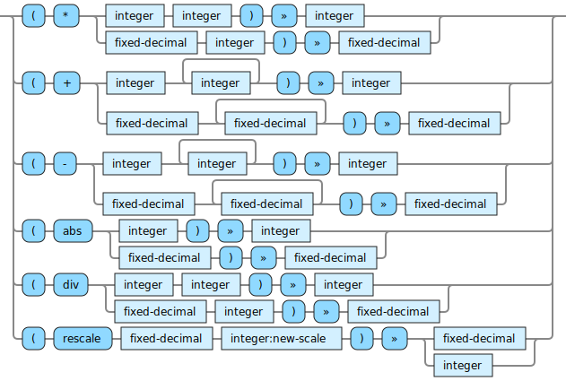

<!---
  This markdown file was generated. Do not edit.
  -->

# Halite reference: Produce fixed-decimals

Operations that produce fixed-decimal output values.

For basic syntax of this data type see: [`fixed-decimal`](halite-basic-syntax-reference.md#fixed-decimal)

#### [`*`](halite-full-reference.md#_S)

Multiply two numbers together.

#### [`+`](halite-full-reference.md#_A)

Add two numbers together.

#### [`-`](halite-full-reference.md#-)

Subtract one number from another.

#### [`abs`](halite-full-reference.md#abs)

Compute the absolute value of a number.

#### [`div`](halite-full-reference.md#div)

Divide the first number by the second. When the first argument is an integer the result is truncated to an integer value. When the first argument is a fixed-decimal the result is truncated to the same precision as the first argument.

#### [`rescale`](halite-full-reference.md#rescale)

Produce a number by adjusting the scale of the fixed-decimal to the new-scale. If the scale is being reduced, the original number is truncated. If the scale is being increased, then the original number is padded with zeroes in the decimal places. If the new-scale is zero, then the result is an integer.

---
