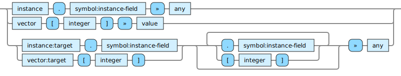

<!---
  This markdown file was generated. Do not edit.
  -->

# Jadeite instance-field-op reference

### instance-field-op

Operations that operate on fields of spec-instances.

#### [`ACCESSOR`](jadeite-full-reference.md#ACCESSOR)

Extract the given item from the first argument. If the first argument is an instance, extract the value for the given field from the given instance. For optional fields, this may produce 'unset'. Otherwise this will always produce a value. If the first argument is a vector, then extract the value at the given index in the vector. The index in this case is zero based.

#### [`ACCESSOR-CHAIN`](jadeite-full-reference.md#ACCESSOR-CHAIN)

A path of element accessors can be created by chaining together element access forms in sequence.

---
