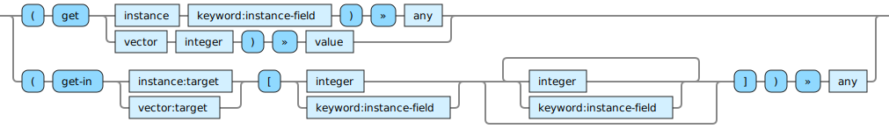

<!---
  This markdown file was generated. Do not edit.
  -->

# Halite instance-field-op reference

### instance-field-op

Operations that operate on fields of spec-instances.

For basic syntax of this data type see: [`instance`](halite-basic-syntax-reference.md#instance)

#### [`get`](halite-full-reference.md#get)

Extract the given item from the first argument. If the first argument is an instance, extract the value for the given field from the given instance. For optional fields, this may produce 'unset'. Otherwise this will always produce a value. If the first argument is a vector, then extract the value at the given index in the vector. The index in this case is zero based.

#### [`get-in`](halite-full-reference.md#get-in)

Syntactic sugar for performing the equivalent of a chained series of 'get' operations. The second argument is a vector that represents the logical path to be navigated through the first argument.

---
