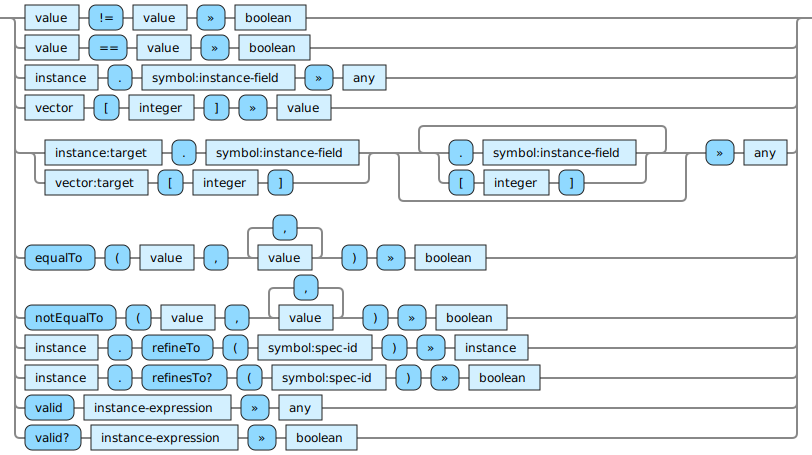

<!---
  This markdown file was generated. Do not edit.
  -->

# Jadeite reference: Instance operations

Operations that operate on spec instances.

For basic syntax of this data type see: [`instance`](jadeite-basic-syntax-reference.md#instance)

#### [`!=`](jadeite-full-reference.md#_B_E)

Produces a false value if all of the values are equal to each other. Otherwise produces a true value.

#### [`==`](jadeite-full-reference.md#_E_E)

Determine if values are equivalent. For vectors and sets this performs a comparison of their contents.

#### [`ACCESSOR`](jadeite-full-reference.md#ACCESSOR)

Extract the given item from the first argument. If the first argument is an instance, extract the value for the given field from the given instance. For optional fields, this may produce 'unset'. Otherwise this will always produce a value. If the first argument is a vector, then extract the value at the given index in the vector. The index in this case is zero based.

#### [`ACCESSOR-CHAIN`](jadeite-full-reference.md#ACCESSOR-CHAIN)

A path of element accessors can be created by chaining together element access forms in sequence.

#### [`equalTo`](jadeite-full-reference.md#equalTo)

Determine if values are equivalent. For vectors and sets this performs a comparison of their contents.

#### [`notEqualTo`](jadeite-full-reference.md#notEqualTo)

Produces a false value if all of the values are equal to each other. Otherwise produces a true value.

#### [`refineTo`](jadeite-full-reference.md#refineTo)

Attempt to refine the given instance into an instance of type, spec-id.

#### [`refinesTo?`](jadeite-full-reference.md#refinesTo_Q)

Determine whether it is possible to refine the given instance into an instance of type, spec-id.

#### [`valid`](jadeite-full-reference.md#valid)

Evaluate the instance-expression and produce the result. If a constraint violation occurs while evaluating the expression then produce an 'unset' value.

#### [`valid?`](jadeite-full-reference.md#valid_Q)

Evaluate the instance expression and produce false if a constraint violation occurs during the evaluation. Otherwise, produce true.

---
