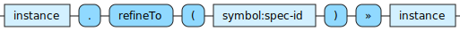

<!---
  This markdown file was generated. Do not edit.
  -->

# Jadeite instance-out reference

### instance-out

Operations that produce spec instances.

For basic syntax of this data type see: [`instance`](jadeite-basic-syntax-reference.md#instance)

#### [`refineTo`](jadeite-full-reference.md#refineTo)

Attempt to refine the given instance into an instance of type, spec-id.

---
