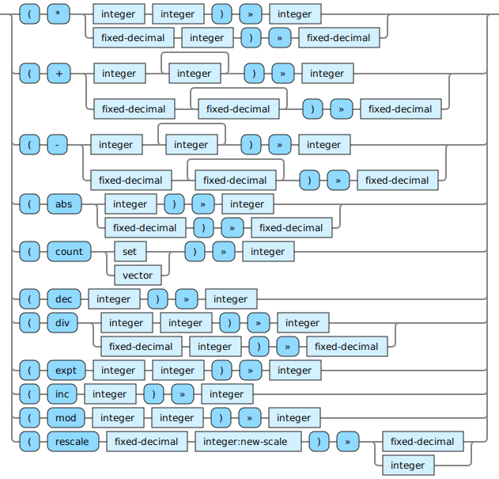

<!---
  This markdown file was generated. Do not edit.
  -->

# Halite reference: Produce integer

### Operations that produce integer output values.

For basic syntax of this data type see: [`integer`](halite-basic-syntax-reference.md#integer)

#### [`*`](halite-full-reference.md#_S)

Multiply two numbers together.

#### [`+`](halite-full-reference.md#_A)

Add two numbers together.

#### [`-`](halite-full-reference.md#-)

Subtract one number from another.

#### [`abs`](halite-full-reference.md#abs)

Compute the absolute value of a number.

#### [`count`](halite-full-reference.md#count)

Return how many items are in a collection.

#### [`dec`](halite-full-reference.md#dec)

Decrement a numeric value.

#### [`div`](halite-full-reference.md#div)

Divide the first number by the second. When the first argument is an integer the result is truncated to an integer value. When the first argument is a fixed-decimal the result is truncated to the same precision as the first argument.

#### [`expt`](halite-full-reference.md#expt)

Compute the numeric result of raising the first argument to the power given by the second argument. The exponent argument cannot be negative.

#### [`inc`](halite-full-reference.md#inc)

Increment a numeric value.

#### [`mod`](halite-full-reference.md#mod)

Computes the mathematical modulus of two numbers. Use care if one of the arguments is negative.

#### [`rescale`](halite-full-reference.md#rescale)

Produce a number by adjusting the scale of the fixed-decimal to the new-scale. If the scale is being reduced, the original number is truncated. If the scale is being increased, then the original number is padded with zeroes in the decimal places. If the new-scale is zero, then the result is an integer.

---
