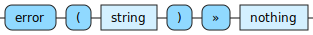

<!---
  This markdown file was generated. Do not edit.
  -->

# Jadeite nothing-out reference

### nothing-out

Operations that produce 'nothing'.

#### [`error`](jadeite-full-reference.md#error)

Produce a runtime error with the provided string as an error message.

---
