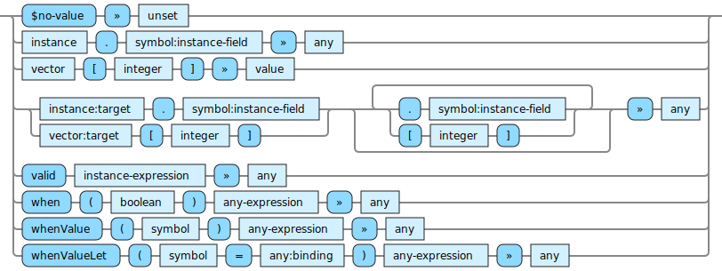

<!---
  This markdown file was generated. Do not edit.
  -->

# Jadeite optional-out reference

### optional-out

Operations that produce optional values.

#### [`$no-value`](jadeite-full-reference.md#_Dno-value)

Constant that produces the special 'unset' value which represents the lack of a value.

#### [`ACCESSOR`](jadeite-full-reference.md#ACCESSOR)

Extract the given item from the first argument. If the first argument is an instance, extract the value for the given field from the given instance. For optional fields, this may produce 'unset'. Otherwise this will always produce a value. If the first argument is a vector, then extract the value at the given index in the vector. The index in this case is zero based.

#### [`ACCESSOR-CHAIN`](jadeite-full-reference.md#ACCESSOR-CHAIN)

A path of element accessors can be created by chaining together element access forms in sequence.

#### [`valid`](jadeite-full-reference.md#valid)

Evaluate the instance-expression and produce the result. If a constraint violation occurs while evaluating the expression then produce an 'unset' value.

#### [`when`](jadeite-full-reference.md#when)

If the first argument is true, then evaluate the second argument, otherwise produce 'unset'.

#### [`whenValue`](jadeite-full-reference.md#whenValue)

Consider the value bound to the symbol. If it is a 'value', then evaluate the second argument. If instead it is 'unset' then produce unset.

#### [`whenValueLet`](jadeite-full-reference.md#whenValueLet)

If the binding value is a 'value' then evaluate the second argument with the symbol bound to binding. If instead, the binding value is 'unset', then produce 'unset'

---
