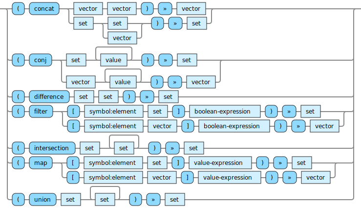

<!---
  This markdown file was generated. Do not edit.
  -->

# Halite reference: Produce sets

Operations that produce sets.

For basic syntax of this data type see: [`set`](halite-basic-syntax-reference.md#set)

#### [`concat`](halite-full-reference.md#concat)

Combine two collections into one.

#### [`conj`](halite-full-reference.md#conj)

Add individual items to a collection.

#### [`difference`](halite-full-reference.md#difference)

Compute the set difference of two sets.

#### [`filter`](halite-full-reference.md#filter)

Produce a new collection which contains only the elements from the original collection for which the boolean-expression is true. When applied to a vector, the order of the elements in the result preserves the order from the original vector.

#### [`intersection`](halite-full-reference.md#intersection)

Compute the set intersection of the sets.

#### [`map`](halite-full-reference.md#map)

Produce a new collection from a collection by evaluating the expression with the symbol bound to each element of the original collection, one-by-one. The results of evaluating the expression will be in the resulting collection. When operating on a vector, the order of the output vector will correspond to the order of the items in the original vector.

#### [`union`](halite-full-reference.md#union)

Compute the union of all the sets.

---
