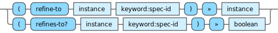

<!---
  This markdown file was generated. Do not edit.
  -->

# Halite reference: Spec-id operations

Operations that operate on spec identifiers.

For basic syntax of this data type see: [`keyword`](halite-basic-syntax-reference.md#keyword)

#### [`refine-to`](halite-full-reference.md#refine-to)

Attempt to refine the given instance into an instance of type, spec-id.

#### [`refines-to?`](halite-full-reference.md#refines-to_Q)

Determine whether it is possible to refine the given instance into an instance of type, spec-id.

---
