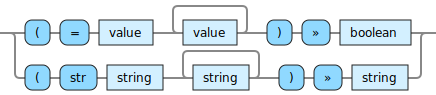

<!---
  This markdown file was generated. Do not edit.
  -->

# Halite reference: String operations

### Operations that operate on string values.

For basic syntax of this data type see: [`string`](halite-basic-syntax-reference.md#string)

#### [`str`](halite-full-reference.md#str)

Combine all of the input strings together in sequence to produce a new string.

---
