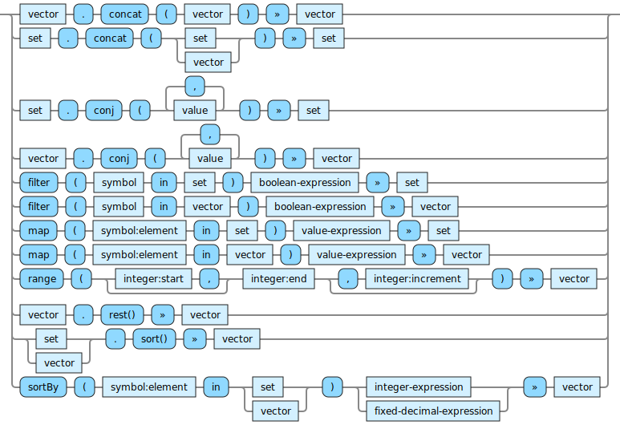

<!---
  This markdown file was generated. Do not edit.
  -->

# Jadeite vector-out reference

### vector-out

Operations that produce vectors.

For basic syntax of this data type see: [`vector`](jadeite-basic-syntax-reference.md#vector)

#### [`concat`](jadeite-full-reference.md#concat)

Combine two collections into one.

#### [`conj`](jadeite-full-reference.md#conj)

Add individual items to a collection.

#### [`filter`](jadeite-full-reference.md#filter)

Produce a new collection which contains only the elements from the original collection for which the boolean-expression is true. When applied to a vector, the order of the elements in the result preserves the order from the original vector.

#### [`map`](jadeite-full-reference.md#map)

Produce a new collection from a collection by evaluating the expression with the symbol bound to each element of the original collection, one-by-one. The results of evaluating the expression will be in the resulting collection. When operating on a vector, the order of the output vector will correspond to the order of the items in the original vector.

#### [`range`](jadeite-full-reference.md#range)

Produce a vector that contains integers in order starting at either the start value or 0 if no start is provided. The final element of the vector will be no more than one less than the end value. If an increment is provided then only every increment integer will be included in the result.

#### [`rest`](jadeite-full-reference.md#rest)

Produce a new vector which contains the same element of the argument, in the same order, except the first element is removed. If there are no elements in the argument, then an empty vector is produced.

#### [`sort`](jadeite-full-reference.md#sort)

Produce a new vector by sorting all of the items in the argument. Only collections of numeric values may be sorted.

#### [`sortBy`](jadeite-full-reference.md#sortBy)

Produce a new vector by sorting all of the items in the input collection according to the values produced by applying the expression to each element. The expression must produce a unique, sortable value for each element.

---
