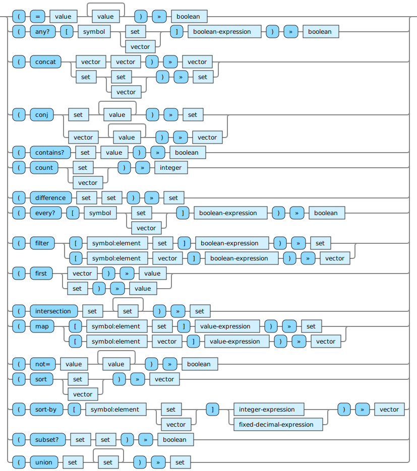

<!---
  This markdown file was generated. Do not edit.
  -->

# Halite reference: Set operations

Operations that operate on sets.

For basic syntax of this data type see: [`set`](halite_basic-syntax-reference.md#set)

#### [`=`](halite_full-reference.md#_E)

Determine if values are equivalent. For vectors and sets this performs a comparison of their contents.

#### [`any?`](halite_full-reference.md#any_Q)

Evaluates to true if the boolean-expression is true when the symbol is bound to some element in the collection.

#### [`concat`](halite_full-reference.md#concat)

Combine two collections into one.

#### [`conj`](halite_full-reference.md#conj)

Add individual items to a collection.

#### [`contains?`](halite_full-reference.md#contains_Q)

Determine if a specific value is in a set.

#### [`count`](halite_full-reference.md#count)

Return how many items are in a collection.

#### [`difference`](halite_full-reference.md#difference)

Compute the set difference of two sets.

#### [`every?`](halite_full-reference.md#every_Q)

Evaluates to true if the boolean-expression is true when the symbol is bound to each the element in the collection.

#### [`filter`](halite_full-reference.md#filter)

Produce a new collection which contains only the elements from the original collection for which the boolean-expression is true. When applied to a vector, the order of the elements in the result preserves the order from the original vector.

#### [`first`](halite_full-reference.md#first)

Produce the first element from a vector or from a set. However, it can only be applied to a set if the set contains a single value. Otherwise, since a set is not ordered, the notion of "first" does not apply.

#### [`intersection`](halite_full-reference.md#intersection)

Compute the set intersection of the sets.

#### [`map`](halite_full-reference.md#map)

Produce a new collection from a collection by evaluating the expression with the symbol bound to each element of the original collection, one-by-one. The results of evaluating the expression will be in the resulting collection. When operating on a vector, the order of the output vector will correspond to the order of the items in the original vector.

#### [`not=`](halite_full-reference.md#not_E)

Produces a false value if all of the values are equal to each other. Otherwise produces a true value.

#### [`sort`](halite_full-reference.md#sort)

Produce a new vector by sorting all of the items in the argument. Only collections of numeric values may be sorted.

#### [`sort-by`](halite_full-reference.md#sort-by)

Produce a new vector by sorting all of the items in the input collection according to the values produced by applying the expression to each element. The expression must produce a unique, sortable value for each element.

#### [`subset?`](halite_full-reference.md#subset_Q)

Return false if there are any items in the first set which do not appear in the second set. Otherwise return true.

#### [`union`](halite_full-reference.md#union)

Compute the union of all the sets.

---
