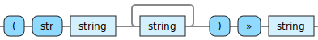

<!---
  This markdown file was generated. Do not edit.
  -->

# Halite reference: Produce strings

Operations that produce string values

For basic syntax of this data type see: [`string`](halite_basic-syntax-reference.md#string)

#### [`str`](halite_full-reference.md#str)

Combine all of the input strings together in sequence to produce a new string.

---
