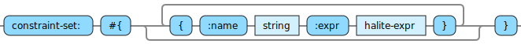
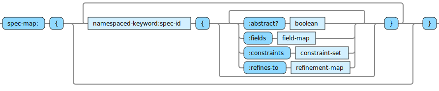

<!---
  This markdown file was generated. Do not edit.
  -->

A spec-map is a data structure used to define specs that are in context for evaluating some expressions.

The syntax diagrams are a graphical representation of the grammar rules for the different elements in spec-maps.

In the diagrams when a rule starts with 'element_name:', this is not part of the syntax for the grammar element, but is instead naming the grammar element so it can be referenced in subsequent diagrams.

In the diagrams when a grammar element appears as 'x:label' the label is simply a descriptive label to convey to the reader the meaining of the element.

Specs include variables which have types as:

The variables for a spec are defined in a field-map:

Constraints on those variables are defined as:

Any applicable refinements are defined as:

All the specs in scope are packaged up into a spec-map:

Note, of course each key can only appear once in each map that defines a spec. The diagram shows it this way just so it is easier to read.