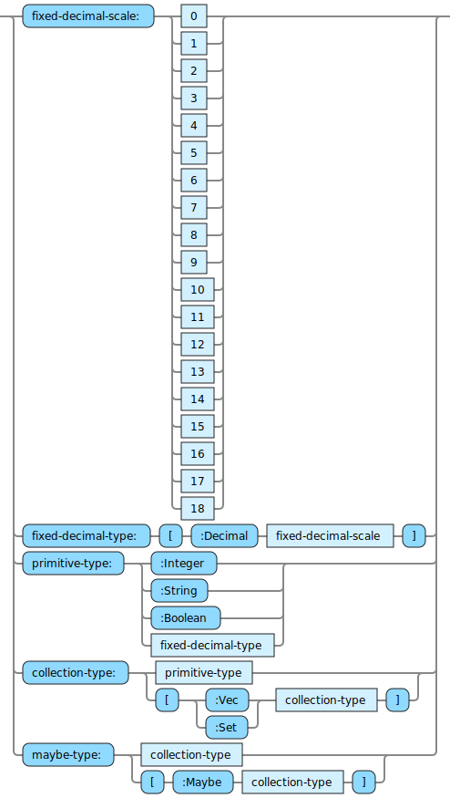

A spec-map is a data structure used to define specs that are in context for evaluating some expressions.

Specs include variables which have types as:

The variables for a spec are defined in a spec-var-map:

Constraints on those variables are defined as:

Any applicable refinements are defined as:

All the specs in scope are packaged up into a spec-map:

Note, of course each key can only appear once in each map that defines a spec. The diagram shows it this way just so it is easier to read.