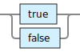
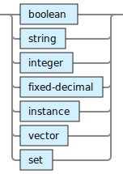

<!---
  This markdown file was generated. Do not edit.
  -->

# Jadeite basic syntax reference

### <a name="non-numeric-character"></a>non-numeric-character


---
### <a name="plus-minus-character"></a>plus-minus-character


---
### <a name="symbol-character"></a>symbol-character


---
### <a name="bare-symbol"></a>bare-symbol


!["plus-minus-character | ((non-numeric-character | plus-minus-character) [{symbol-character}])"](./halite-bnf-diagrams/basic-syntax/bare-symbol-j.svg)

---
### <a name="symbol"></a>symbol

Symbols are identifiers that allow values and operations to be named. The following are reserved and cannot be used as user defined symbols: true, false, nil.

!["(bare-symbol [ '/' bare-symbol]) | ('’' bare-symbol [ '/' bare-symbol] '’')"](./halite-bnf-diagrams/basic-syntax/symbol-j.svg)

Symbols are used to identify operators, variables in expressions, specifications, and fields within specifications. Symbols are not values. There are no expressions that produce symbols. Anywhere that a symbol is called for in an operator argument list, a literal symbol must be provided. Symbols passed as arguments to operators are not evaluated. Symbols used within expressions in general are evaluated prior to invoking the operator. The following are also legal symbols, but they are reserved for system use: &&, ||, /, %, |

<table><tr><td colspan="1">

```java
a
```

</td><td colspan="1">

```java
a.b
```

</td><td colspan="1">

```java
'a/b'
```

</td></tr></table>

#### Possible errors:

* [`h-err/invalid-symbol-char`](jadeite-err-id-reference.md#h-err/invalid-symbol-char)
* [`h-err/invalid-symbol-length`](jadeite-err-id-reference.md#h-err/invalid-symbol-length)

Tags: [Instance field operations](halite-instance-field-op-reference-j.md) [Instance operations](halite-instance-op-reference-j.md) [Produce instances](halite-instance-out-reference-j.md) [Spec-id operations](halite-spec-id-op-reference-j.md)

---
### <a name="boolean"></a>boolean




Tags: [Boolean operations](halite-boolean-op-reference-j.md) [Produce booleans](halite-boolean-out-reference-j.md)

---
### <a name="string"></a>string

Strings are sequences of characters. Strings can be multi-line. Quotation marks can be included if escaped with a \. A backslash can be included with the character sequence: \\ . Strings can include special characters, e.g. \t for a tab and \n for a newline, as well as unicode via \uNNNN. Unicode can also be directly entered in strings. Additional character representations may work but the only representations that are guaranteed to work are those documented here.


<table><tr><td colspan="1">

```java
""
```

</td><td colspan="1">

```java
"hello"
```

</td><td colspan="1">

```java
"say \"hi\" now"

### result ###
"say \"hi\" now"
```

</td><td colspan="1">

```java
"one \\ two"

### result ###
"one \\ two"
```

</td><td colspan="1">

```java
"\t\n"

### result ###
"\t\n"
```

</td></tr><tr><td colspan="1">

```java
"☺"

### result ###
"☺"
```

</td><td colspan="1">

```java
"\u263A"

### result ###
"☺"
```

</td></tr></table>

#### Possible errors:

* [`h-err/size-exceeded`](jadeite-err-id-reference.md#h-err/size-exceeded)

Tags: [String operations](halite-string-op-reference-j.md)

---
### <a name="integer"></a>integer

Signed numeric integer values with no decimal places. Alternative integer representations may work, but the only representation that is guaranteed to work on an ongoing basis is that documented here.

!["[plus-minus-character] '0-9' {'0-9'}"](./halite-bnf-diagrams/basic-syntax/integer-j.svg)

<table><tr><td colspan="1">

```java
0
```

</td><td colspan="1">

```java
1
```

</td><td colspan="1">

```java
1
```

</td><td colspan="1">

```java
-1
```

</td><td colspan="1">

```java
9223372036854775807
```

</td></tr><tr><td colspan="1">

```java
-9223372036854775808
```

</td></tr></table>

Tags: [Integer operations](halite-integer-op-reference-j.md) [Produce integer](halite-integer-out-reference-j.md)

---
### <a name="fixed-decimal"></a>fixed-decimal

Signed numeric values with decimal places.

!["'#' 'd' [whitespace] '\"' ['-'] ('0' | ('1-9' {'0-9'})) '.' '0-9' {'0-9'} '\"'"](./halite-bnf-diagrams/basic-syntax/fixed-decimal-j.svg)

<table><tr><td colspan="1">

```java
#d "1.1"
```

</td><td colspan="1">

```java
#d "-1.1"
```

</td><td colspan="1">

```java
#d "1.00"
```

</td><td colspan="1">

```java
#d "0.00"
```

</td></tr></table>

Tags: [Fixed-decimal operations](halite-fixed-decimal-op-reference-j.md) [Produce fixed-decimals](halite-fixed-decimal-out-reference-j.md)

---
### <a name="instance"></a>instance

Represents an instance of a specification.


The contents of the instance are specified in pair-wise fashion with alternating field names and field values. The special field name '$type' is mandatory but cannot be used as the other fields are. 

<table><tr><td colspan="2">

```java
{$type: my/Spec$v1, x: 1, y: -1}
```

</td></tr></table>

#### Possible errors:

* [`h-err/field-name-not-in-spec`](jadeite-err-id-reference.md#h-err/field-name-not-in-spec)
* [`h-err/field-value-of-wrong-type`](jadeite-err-id-reference.md#h-err/field-value-of-wrong-type)
* [`h-err/invalid-instance`](jadeite-err-id-reference.md#h-err/invalid-instance)
* [`h-err/invalid-type-value`](jadeite-err-id-reference.md#h-err/invalid-type-value)
* [`h-err/missing-required-vars`](jadeite-err-id-reference.md#h-err/missing-required-vars)
* [`h-err/missing-type-field`](jadeite-err-id-reference.md#h-err/missing-type-field)
* [`h-err/no-abstract`](jadeite-err-id-reference.md#h-err/no-abstract)
* [`h-err/not-boolean-constraint`](jadeite-err-id-reference.md#h-err/not-boolean-constraint)
* [`h-err/resource-spec-not-found`](jadeite-err-id-reference.md#h-err/resource-spec-not-found)

Tags: [Instance field operations](halite-instance-field-op-reference-j.md) [Instance operations](halite-instance-op-reference-j.md) [Produce instances](halite-instance-out-reference-j.md)

---
### <a name="vector"></a>vector

A collection of values in a prescribed sequence.

!["'[' [whitespace] [value] [whitespace] {',' [whitespace] value [whitespace]} [whitespace]']'"](./halite-bnf-diagrams/basic-syntax/vector-j.svg)

<table><tr><td colspan="1">

```java
[]
```

</td><td colspan="1">

```java
[1, 2, 3]
```

</td></tr></table>

#### Possible errors:

* [`h-err/literal-must-evaluate-to-value`](jadeite-err-id-reference.md#h-err/literal-must-evaluate-to-value)
* [`h-err/size-exceeded`](jadeite-err-id-reference.md#h-err/size-exceeded)

Tags: [Vector operations](halite-vector-op-reference-j.md) [Produce vectors](halite-vector-out-reference-j.md)

---
### <a name="set"></a>set

A collection of values in an unordered set. Duplicates are not allowed.

!["'#' '{' [whitespace] [value] [whitespace] {',' [whitespace] value [whitespace]} '}'"](./halite-bnf-diagrams/basic-syntax/set-j.svg)

The members of sets are not directly accessible. If it is necessary to access the members of a set, it is recommended to design the data structures going into the sets in such a way that the set can be sorted into a vector for access.  

<table><tr><td colspan="1">

```java
#{}
```

</td><td colspan="1">

```java
#{1, 2, 3}
```

</td></tr></table>

#### Possible errors:

* [`h-err/literal-must-evaluate-to-value`](jadeite-err-id-reference.md#h-err/literal-must-evaluate-to-value)
* [`h-err/size-exceeded`](jadeite-err-id-reference.md#h-err/size-exceeded)

Tags: [Set operations](halite-set-op-reference-j.md) [Produce sets](halite-set-out-reference-j.md)

---
### <a name="value"></a>value

Expressions and many literals produce values.



---
### <a name="any"></a>any

Refers to either the presence of absence of a value.


---
