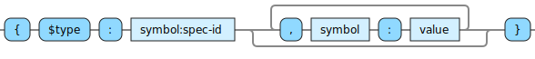

<!---
  This markdown file was generated. Do not edit.
  -->

# Jadeite basic syntax reference

### <a name="non-numeric-character"></a>non-numeric-character


---
### <a name="plus-minus-character"></a>plus-minus-character


---
### <a name="symbol-character"></a>symbol-character


---
### <a name="simple-symbol"></a>simple-symbol


!["plus-minus-character | ((non-numeric-character | plus-minus-character) [{symbol-character}])"](./halite-bnf-diagrams/basic-syntax/simple-symbol-j.svg)

---
### <a name="symbol"></a>symbol


!["(simple-symbol [ '/' simple-symbol]) | ('’' simple-symbol [ '/' simple-symbol] '’')"](./halite-bnf-diagrams/basic-syntax/symbol-j.svg)

Symbols are used to identify operators, variables in expressions, and specifications.

<table><tr><td colspan="1">

```java
a
```

</td><td colspan="1">

```java
a.b
```

</td><td colspan="1">

```java
a/b
```

</td></tr></table>

---
### <a name="boolean"></a>boolean


---
### <a name="string"></a>string


<table><tr><td colspan="1">

```java
""
```

</td><td colspan="1">

```java
"hello"
```

</td><td colspan="1">

```java
"say \"hi\" now" 
```

</td><td colspan="1">

```java
"one \\ two"
```

</td><td colspan="1">

```java
"\t\n"
```

</td></tr><tr><td colspan="1">

```java
"☺"
```

</td><td colspan="1">

```java
"\u263A"
```

</td></tr></table>

---
### <a name="integer"></a>integer


!["[plus-minus-character] '0-9' {'0-9'}"](./halite-bnf-diagrams/basic-syntax/integer-j.svg)

<table><tr><td colspan="1">

```java
0
```

</td><td colspan="1">

```java
1
```

</td><td colspan="1">

```java
+1
```

</td><td colspan="1">

```java
-1
```

</td><td colspan="1">

```java
9223372036854775807
```

</td></tr><tr><td colspan="1">

```java
-9223372036854775808
```

</td></tr></table>

---
### <a name="fixed-decimal"></a>fixed-decimal


!["'#' 'd' [whitespace] '\"' ['-'] ('0' | ('1-9' {'0-9'})) '.' '0-9' {'0-9'} '\"'"](./halite-bnf-diagrams/basic-syntax/fixed-decimal-j.svg)

<table><tr><td colspan="1">

```java
#d "1.1"
```

</td><td colspan="1">

```java
#d "-1.1"
```

</td><td colspan="1">

```java
#d "1.00"
```

</td><td colspan="1">

```java
#d "0.00"
```

</td></tr></table>

---
### <a name="instance"></a>instance




The contents of the instance are specified in pair-wise fashion with alternating field names and field values.

<table><tr><td colspan="2">

```java
{$type: my/Spec$v1, x: 1, y: -1}
```

</td></tr></table>

---
### <a name="vector"></a>vector


!["'[' [whitespace] [value] [whitespace] {',' [whitespace] value [whitespace]} [whitespace]']'"](./halite-bnf-diagrams/basic-syntax/vector-j.svg)

<table><tr><td colspan="1">

```java
[]
```

</td><td colspan="1">

```java
[1, 2, 3]
```

</td></tr></table>

---
### <a name="set"></a>set


!["'#' '{' [whitespace] [value] [whitespace] {',' [whitespace] value [whitespace]} '}'"](./halite-bnf-diagrams/basic-syntax/set-j.svg)

The members of sets are not directly accessible. If it is necessary to access the members of a set, it is recommended to design the data structures going into the sets in such a way that the set can be sorted into a vector for access.

<table><tr><td colspan="1">

```java
#{}
```

</td><td colspan="1">

```java
#{1, 2, 3}
```

</td></tr></table>

---
### <a name="value"></a>value


---
### <a name="any"></a>any


---
