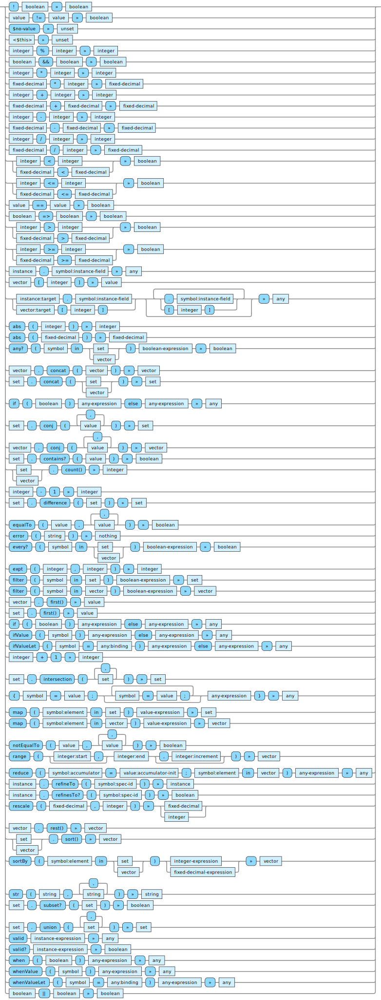

<!---
  This markdown file was generated. Do not edit.
  -->

# Jadeite operator reference (all operators)

## All Operators

The syntax for all of the operators is summarized in the following 



## Operators

### <a name="_B"></a>!

Performs logical negation of the argument.

![["'!' boolean" "boolean"]](./halite-bnf-diagrams/op/not-0-j.svg)

#### Basic elements:

[`boolean`](jadeite-basic-syntax-reference.md#boolean)

#### Examples:

<table><tr><td colspan="1">

```java
!true

//-- result --
false
```

</td><td colspan="1">

```java
!false

//-- result --
true
```

</td></tr></table>

See also: [`&&`](#&&) [`=>`](#_E_G) [`||`](#||)

#### Tags:

 [Boolean operations](halite-boolean-op-reference-j.md),  [Produce booleans](halite-boolean-out-reference-j.md)

---
### <a name="_B_E"></a>!=

Produces a false value if all of the values are equal to each other. Otherwise produces a true value.

![["value '!=' value" "boolean"]](./halite-bnf-diagrams/op/notequal-0-j.svg)

#### Basic elements:

[`boolean`](jadeite-basic-syntax-reference.md#boolean), [`value`](jadeite-basic-syntax-reference.md#value)

#### Examples:

<table><tr><td colspan="1">

```java
(2 != 3)

//-- result --
true
```

</td><td colspan="2">

```java
(#d "2.2" != #d "2.2")

//-- result --
false
```

</td><td colspan="1">

```java
(2 != 2)

//-- result --
false
```

</td><td colspan="1">

```java
notEqualTo(1, 1, 2)

//-- result --
true
```

</td></tr><tr><td colspan="1">

```java
notEqualTo(1, 1, 1)

//-- result --
false
```

</td><td colspan="1">

```java
("hi" != "bye")

//-- result --
true
```

</td><td colspan="2">

```java
([1, 2, 3] != [1, 2, 3, 4])

//-- result --
true
```

</td></tr><tr><td colspan="2">

```java
([1, 2, 3] != #{1, 2, 3})

//-- result --
true
```

</td><td colspan="2">

```java
(#{1, 2, 3} != #{1, 2, 3})

//-- result --
false
```

</td></tr><tr><td colspan="2">

```java
([#{1, 2}, #{3}] != [#{1, 2}, #{3}])

//-- result --
false
```

</td><td colspan="2">

```java
([#{1, 2}, #{3}] != [#{1, 2}, #{4}])

//-- result --
true
```

</td></tr><tr><td colspan="4">

```java
//-- context --
{
  "my/Spec$v1" : {
    "spec-vars" : {
      "x" : "Integer",
      "y" : "Integer"
    }
  }
}
//

({$type: my/Spec$v1, x: 1, y: -1} != {$type: my/Spec$v1, x: 1, y: 0})

//-- result --
true
```

</td></tr></table>

#### Possible errors:

* [`l-err/result-always-known`](jadeite-err-id-reference.md#l-err/result-always-known)

See also: [`==`](#_E_E) [`equalTo`](#equalTo) [`notEqualTo`](#notEqualTo)

#### Tags:

 [Boolean operations](halite-boolean-op-reference-j.md),  [Produce booleans](halite-boolean-out-reference-j.md),  [Fixed-decimal operations](halite-fixed-decimal-op-reference-j.md),  [Instance operations](halite-instance-op-reference-j.md),  [Integer operations](halite-integer-op-reference-j.md),  [Set operations](halite-set-op-reference-j.md),  [Vector operations](halite-vector-op-reference-j.md)

---
### <a name="_Dno-value"></a>$no-value

Constant that produces the special 'unset' value which represents the lack of a value.

![["'$no-value'" "unset"]](./halite-bnf-diagrams/op/%24no-value-0-j.svg)

#### Basic elements:

[`unset`](jadeite-basic-syntax-reference.md#unset)

Expected use is in an instance expression to indicate that a field in the instance does not have a value. However, it is suggested that alternatives include simply omitting the field name from the instance or using a variant of a 'when' expression to optionally produce a value for the field.

See also: [`when`](#when) [`whenValue`](#whenValue) [`whenValueLet`](#whenValueLet)

#### Tags:

 [Optionally produce values](halite-optional-out-reference-j.md)

---
### <a name="_Dthis"></a>$this

Context dependent reference to the containing object.

![["<$this>" "unset"]](./halite-bnf-diagrams/op/%24this-0-j.svg)

---
### <a name="%"></a>%

Computes the mathematical modulus of two numbers. Use care if one of the arguments is negative.

![["integer '%' integer" "integer"]](./halite-bnf-diagrams/op/mod-0-j.svg)

#### Basic elements:

[`integer`](jadeite-basic-syntax-reference.md#integer)

#### Examples:

<table><tr><td colspan="1">

```java
(12 % 3)

//-- result --
0
```

</td><td colspan="1">

```java
(14 % 4)

//-- result --
2
```

</td><td colspan="1">

```java
(1 % 0)

//-- result --
h-err/divide-by-zero
```

</td><td colspan="1">

```java
(1 % 3)

//-- result --
1
```

</td><td colspan="1">

```java
(-1 % 3)

//-- result --
2
```

</td></tr><tr><td colspan="1">

```java
(1 % -3)

//-- result --
-2
```

</td><td colspan="1">

```java
(-1 % -3)

//-- result --
-1
```

</td></tr></table>

#### Possible errors:

* [`h-err/divide-by-zero`](jadeite-err-id-reference.md#h-err/divide-by-zero)

#### Tags:

 [Integer operations](halite-integer-op-reference-j.md),  [Produce integer](halite-integer-out-reference-j.md)

---
### <a name="&&"></a>&&

Perform a logical 'and' operation on the input values.

![["boolean '&&' boolean" "boolean"]](./halite-bnf-diagrams/op/and-0-j.svg)

#### Basic elements:

[`boolean`](jadeite-basic-syntax-reference.md#boolean)

The operation does not short-circuit. Even if the first argument evaluates to false the other arguments are still evaluated.

#### Examples:

<table><tr><td colspan="1">

```java
(true && false)

//-- result --
false
```

</td><td colspan="1">

```java
(true && true)

//-- result --
true
```

</td><td colspan="2">

```java
((2 > 1) && (3 > 2) && (4 > 3))

//-- result --
true
```

</td></tr></table>

See also: [`!`](#_B) [`=>`](#_E_G) [`every?`](#every_Q) [`||`](#||)

#### Tags:

 [Boolean operations](halite-boolean-op-reference-j.md),  [Produce booleans](halite-boolean-out-reference-j.md)

---
### <a name="_S"></a>*

Multiply two numbers together.

![["integer '*' integer" "integer"]](./halite-bnf-diagrams/op/*-0-j.svg)

![["fixed-decimal '*' integer" "fixed-decimal"]](./halite-bnf-diagrams/op/*-1-j.svg)

#### Basic elements:

[`fixed-decimal`](jadeite-basic-syntax-reference.md#fixed-decimal), [`integer`](jadeite-basic-syntax-reference.md#integer)

Note that fixed-decimal values cannot be multiplied together. Rather the multiplication operator is used to scale a fixed-decimal value within the number space of a given scale of fixed-decimal. This can also be used to effectively convert an arbitrary integer value into a fixed-decimal number space by multiplying the integer by unity in the fixed-decimal number space of the desired scale.

#### Examples:

<table><tr><td colspan="1">

```java
(2 * 3)

//-- result --
6
```

</td><td colspan="1">

```java
(#d "2.2" * 3)

//-- result --
#d "6.6"
```

</td><td colspan="1">

```java
(2 * 3 * 4)

//-- result --
24
```

</td></tr></table>

#### Possible errors:

* [`h-err/overflow`](jadeite-err-id-reference.md#h-err/overflow)

#### Tags:

 [Fixed-decimal operations](halite-fixed-decimal-op-reference-j.md),  [Produce fixed-decimals](halite-fixed-decimal-out-reference-j.md),  [Integer operations](halite-integer-op-reference-j.md),  [Produce integer](halite-integer-out-reference-j.md)

---
### <a name="_A"></a>+

Add two numbers together.

![["integer '+' integer" "integer"]](./halite-bnf-diagrams/op/plus-0-j.svg)

![["fixed-decimal '+' fixed-decimal" "fixed-decimal"]](./halite-bnf-diagrams/op/plus-1-j.svg)

#### Basic elements:

[`fixed-decimal`](jadeite-basic-syntax-reference.md#fixed-decimal), [`integer`](jadeite-basic-syntax-reference.md#integer)

#### Examples:

<table><tr><td colspan="1">

```java
(2 + 3)

//-- result --
5
```

</td><td colspan="2">

```java
(#d "2.2" + #d "3.3")

//-- result --
#d "5.5"
```

</td><td colspan="1">

```java
(2 + 3 + 4)

//-- result --
9
```

</td><td colspan="1">

```java
(2 + -3)

//-- result --
-1
```

</td></tr></table>

#### Possible errors:

* [`h-err/overflow`](jadeite-err-id-reference.md#h-err/overflow)

#### Tags:

 [Fixed-decimal operations](halite-fixed-decimal-op-reference-j.md),  [Produce fixed-decimals](halite-fixed-decimal-out-reference-j.md),  [Integer operations](halite-integer-op-reference-j.md),  [Produce integer](halite-integer-out-reference-j.md)

---
### <a name="-"></a>-

Subtract one number from another.

![["integer '-' integer" "integer"]](./halite-bnf-diagrams/op/minus-0-j.svg)

![["fixed-decimal '-' fixed-decimal" "fixed-decimal"]](./halite-bnf-diagrams/op/minus-1-j.svg)

#### Basic elements:

[`fixed-decimal`](jadeite-basic-syntax-reference.md#fixed-decimal), [`integer`](jadeite-basic-syntax-reference.md#integer)

#### Examples:

<table><tr><td colspan="1">

```java
(2 - 3)

//-- result --
-1
```

</td><td colspan="2">

```java
(#d "2.2" - #d "3.3")

//-- result --
#d "-1.1"
```

</td><td colspan="1">

```java
(2 - 3 - 4)

//-- result --
-5
```

</td><td colspan="1">

```java
(2 - -3)

//-- result --
5
```

</td></tr></table>

#### Possible errors:

* [`h-err/overflow`](jadeite-err-id-reference.md#h-err/overflow)

#### Tags:

 [Fixed-decimal operations](halite-fixed-decimal-op-reference-j.md),  [Produce fixed-decimals](halite-fixed-decimal-out-reference-j.md),  [Integer operations](halite-integer-op-reference-j.md),  [Produce integer](halite-integer-out-reference-j.md)

---
### <a name="/"></a>/

Divide the first number by the second. When the first argument is an integer the result is truncated to an integer value. When the first argument is a fixed-decimal the result is truncated to the same precision as the first argument.

![["integer '/' integer" "integer"]](./halite-bnf-diagrams/op/div-0-j.svg)

![["fixed-decimal '/' integer" "fixed-decimal"]](./halite-bnf-diagrams/op/div-1-j.svg)

#### Basic elements:

[`fixed-decimal`](jadeite-basic-syntax-reference.md#fixed-decimal), [`integer`](jadeite-basic-syntax-reference.md#integer)

As with multiplication, fixed-decimal values cannot be divided by each other, instead a fixed-decimal value can be scaled down within the number space of that scale.

#### Examples:

<table><tr><td colspan="1">

```java
(12 / 3)

//-- result --
4
```

</td><td colspan="1">

```java
(#d "12.3" / 3)

//-- result --
#d "4.1"
```

</td><td colspan="1">

```java
(14 / 4)

//-- result --
3
```

</td><td colspan="1">

```java
(#d "14.3" / 3)

//-- result --
#d "4.7"
```

</td><td colspan="1">

```java
(1 / 0)

//-- result --
h-err/divide-by-zero
```

</td></tr></table>

#### Possible errors:

* [`h-err/divide-by-zero`](jadeite-err-id-reference.md#h-err/divide-by-zero)

See also: [`%`](#%)

#### Tags:

 [Fixed-decimal operations](halite-fixed-decimal-op-reference-j.md),  [Produce fixed-decimals](halite-fixed-decimal-out-reference-j.md),  [Integer operations](halite-integer-op-reference-j.md),  [Produce integer](halite-integer-out-reference-j.md)

---
### <a name="_L"></a><

Determine if a number is strictly less than another.

![["((integer '<'  integer) | (fixed-decimal '<' fixed-decimal))" "boolean"]](./halite-bnf-diagrams/op/%3C-0-j.svg)

#### Basic elements:

[`boolean`](jadeite-basic-syntax-reference.md#boolean), [`fixed-decimal`](jadeite-basic-syntax-reference.md#fixed-decimal), [`integer`](jadeite-basic-syntax-reference.md#integer)

#### Examples:

<table><tr><td colspan="1">

```java
(2 < 3)

//-- result --
true
```

</td><td colspan="2">

```java
(#d "2.2" < #d "3.3")

//-- result --
true
```

</td><td colspan="1">

```java
(2 < 2)

//-- result --
false
```

</td></tr></table>

#### Tags:

 [Produce booleans](halite-boolean-out-reference-j.md),  [Fixed-decimal operations](halite-fixed-decimal-op-reference-j.md),  [Integer operations](halite-integer-op-reference-j.md)

---
### <a name="_L_E"></a><=

Determine if a number is less than or equal to another.

![["((integer '<=' integer) | (fixed-decimal '<=' fixed-decimal))" "boolean"]](./halite-bnf-diagrams/op/%3C%3D-0-j.svg)

#### Basic elements:

[`boolean`](jadeite-basic-syntax-reference.md#boolean), [`fixed-decimal`](jadeite-basic-syntax-reference.md#fixed-decimal), [`integer`](jadeite-basic-syntax-reference.md#integer)

#### Examples:

<table><tr><td colspan="1">

```java
(2 <= 3)

//-- result --
true
```

</td><td colspan="2">

```java
(#d "2.2" <= #d "3.3")

//-- result --
true
```

</td><td colspan="1">

```java
(2 <= 2)

//-- result --
true
```

</td></tr></table>

#### Tags:

 [Produce booleans](halite-boolean-out-reference-j.md),  [Fixed-decimal operations](halite-fixed-decimal-op-reference-j.md),  [Integer operations](halite-integer-op-reference-j.md)

---
### <a name="_E_E"></a>==

Determine if values are equivalent. For vectors and sets this performs a comparison of their contents.

![["value '==' value" "boolean"]](./halite-bnf-diagrams/op/doublequal-0-j.svg)

#### Basic elements:

[`boolean`](jadeite-basic-syntax-reference.md#boolean), [`value`](jadeite-basic-syntax-reference.md#value)

#### Examples:

<table><tr><td colspan="1">

```java
(2 == 2)

//-- result --
true
```

</td><td colspan="2">

```java
(#d "2.2" == #d "3.3")

//-- result --
false
```

</td><td colspan="1">

```java
(2 == 3)

//-- result --
false
```

</td><td colspan="1">

```java
equalTo(1, 1, 1)

//-- result --
true
```

</td></tr><tr><td colspan="1">

```java
equalTo(1, 1, 2)

//-- result --
false
```

</td><td colspan="1">

```java
("hi" == "hi")

//-- result --
true
```

</td><td colspan="2">

```java
([1, 2, 3] == [1, 2, 3])

//-- result --
true
```

</td></tr><tr><td colspan="2">

```java
([1, 2, 3] == #{1, 2, 3})

//-- result --
false
```

</td><td colspan="2">

```java
(#{1, 2, 3} == #{1, 2, 3})

//-- result --
true
```

</td></tr><tr><td colspan="2">

```java
([#{1, 2}, #{3}] == [#{1, 2}, #{3}])

//-- result --
true
```

</td><td colspan="2">

```java
([#{1, 2}, #{3}] == [#{1, 2}, #{4}])

//-- result --
false
```

</td></tr><tr><td colspan="4">

```java
//-- context --
{
  "my/Spec$v1" : {
    "spec-vars" : {
      "x" : "Integer",
      "y" : "Integer"
    }
  }
}
//

({$type: my/Spec$v1, x: 1, y: -1} == {$type: my/Spec$v1, x: 1, y: 0})

//-- result --
false
```

</td></tr><tr><td colspan="4">

```java
//-- context --
{
  "my/Spec$v1" : {
    "spec-vars" : {
      "x" : "Integer",
      "y" : "Integer"
    }
  }
}
//

({$type: my/Spec$v1, x: 1, y: 0} == {$type: my/Spec$v1, x: 1, y: 0})

//-- result --
true
```

</td></tr></table>

#### Possible errors:

* [`l-err/result-always-known`](jadeite-err-id-reference.md#l-err/result-always-known)

See also: [`!=`](#_B_E) [`equalTo`](#equalTo) [`notEqualTo`](#notEqualTo)

#### Tags:

 [Boolean operations](halite-boolean-op-reference-j.md),  [Produce booleans](halite-boolean-out-reference-j.md),  [Fixed-decimal operations](halite-fixed-decimal-op-reference-j.md),  [Instance operations](halite-instance-op-reference-j.md),  [Integer operations](halite-integer-op-reference-j.md),  [Set operations](halite-set-op-reference-j.md),  [Vector operations](halite-vector-op-reference-j.md)

---
### <a name="_E_G"></a>=>

Performs logical implication. If the first value is true, then the second value must also be true for the result to be true. If the first value is false, then the result is true.

![["boolean '=>' boolean" "boolean"]](./halite-bnf-diagrams/op/%3D%3E-0-j.svg)

#### Basic elements:

[`boolean`](jadeite-basic-syntax-reference.md#boolean)

#### Examples:

<table><tr><td colspan="1">

```java
((2 > 1) => (1 < 2))

//-- result --
true
```

</td><td colspan="1">

```java
((2 > 1) => (1 > 2))

//-- result --
false
```

</td><td colspan="1">

```java
((1 > 2) => false)

//-- result --
true
```

</td></tr></table>

See also: [`!`](#_B) [`&&`](#&&) [`every?`](#every_Q) [`||`](#||)

#### Tags:

 [Boolean operations](halite-boolean-op-reference-j.md),  [Produce booleans](halite-boolean-out-reference-j.md)

---
### <a name="_G"></a>>

Determine if a number is strictly greater than another.

![["((integer '>'  integer) | (fixed-decimal '>' fixed-decimal))" "boolean"]](./halite-bnf-diagrams/op/%3E-0-j.svg)

#### Basic elements:

[`boolean`](jadeite-basic-syntax-reference.md#boolean), [`fixed-decimal`](jadeite-basic-syntax-reference.md#fixed-decimal), [`integer`](jadeite-basic-syntax-reference.md#integer)

#### Examples:

<table><tr><td colspan="1">

```java
(3 > 2)

//-- result --
true
```

</td><td colspan="2">

```java
(#d "3.3" > #d "2.2")

//-- result --
true
```

</td><td colspan="1">

```java
(2 > 2)

//-- result --
false
```

</td></tr></table>

#### Tags:

 [Produce booleans](halite-boolean-out-reference-j.md),  [Fixed-decimal operations](halite-fixed-decimal-op-reference-j.md),  [Integer operations](halite-integer-op-reference-j.md)

---
### <a name="_G_E"></a>>=

Determine if a number is greater than or equal to another.

![["((integer '>='  integer) | (fixed-decimal '>=' fixed-decimal))" "boolean"]](./halite-bnf-diagrams/op/%3E%3D-0-j.svg)

#### Basic elements:

[`boolean`](jadeite-basic-syntax-reference.md#boolean), [`fixed-decimal`](jadeite-basic-syntax-reference.md#fixed-decimal), [`integer`](jadeite-basic-syntax-reference.md#integer)

#### Examples:

<table><tr><td colspan="1">

```java
(3 >= 2)

//-- result --
true
```

</td><td colspan="2">

```java
(#d "3.3" >= #d "2.2")

//-- result --
true
```

</td><td colspan="1">

```java
(2 >= 2)

//-- result --
true
```

</td></tr></table>

#### Tags:

 [Produce booleans](halite-boolean-out-reference-j.md),  [Fixed-decimal operations](halite-fixed-decimal-op-reference-j.md),  [Integer operations](halite-integer-op-reference-j.md)

---
### <a name="ACCESSOR"></a>ACCESSOR

Extract the given item from the first argument. If the first argument is an instance, extract the value for the given field from the given instance. For optional fields, this may produce 'unset'. Otherwise this will always produce a value. If the first argument is a vector, then extract the value at the given index in the vector. The index in this case is zero based.

![["(instance '.' symbol:instance-field)" "any"]](./halite-bnf-diagrams/op/ACCESSOR-0-j.svg)

![["(vector '[' integer ']')" "value"]](./halite-bnf-diagrams/op/ACCESSOR-1-j.svg)

#### Basic elements:

[`any`](jadeite-basic-syntax-reference.md#any), [`instance`](jadeite-basic-syntax-reference.md#instance), [`integer`](jadeite-basic-syntax-reference.md#integer), [`symbol`](jadeite-basic-syntax-reference.md#symbol), [`vector`](jadeite-basic-syntax-reference.md#vector)

The $type value of an instance is not considered a field that can be extracted with this operator. When dealing with instances of abstract specifications, it is necessary to refine an instance to a given specification before accessing a field of that specification.

#### Examples:

<table><tr><td colspan="1">

```java
[10, 20, 30, 40][2]

//-- result --
30
```

</td><td colspan="2">

```java
//-- context --
{
  "my/Spec$v1" : {
    "spec-vars" : {
      "x" : "Integer",
      "y" : "Integer"
    }
  }
}
//

{$type: my/Spec$v1, x: -3, y: 2}.x

//-- result --
-3
```

</td></tr></table>

#### Possible errors:

* [`h-err/field-name-not-in-spec`](jadeite-err-id-reference.md#h-err/field-name-not-in-spec)
* [`h-err/index-out-of-bounds`](jadeite-err-id-reference.md#h-err/index-out-of-bounds)
* [`h-err/invalid-instance-index`](jadeite-err-id-reference.md#h-err/invalid-instance-index)
* [`h-err/invalid-vector-index`](jadeite-err-id-reference.md#h-err/invalid-vector-index)

See also: [`ACCESSOR-CHAIN`](#ACCESSOR-CHAIN)

#### Tags:

 [Instance field operations](halite-instance-field-op-reference-j.md),  [Instance operations](halite-instance-op-reference-j.md),  [Optionally produce values](halite-optional-out-reference-j.md),  [Special forms](halite-special-form-reference-j.md),  [Vector operations](halite-vector-op-reference-j.md)

---
### <a name="ACCESSOR-CHAIN"></a>ACCESSOR-CHAIN

A path of element accessors can be created by chaining together element access forms in sequence.

The first path element in the path is looked up in the initial target. If there are more path elements, the next path element is looked up in the result of the first lookup. This is repeated as long as there are more path elements. If this is used to lookup instance fields, then all of the field names must reference mandatory fields unless the field name is the final element of the path. The result will always be a value unless the final path element is a reference to an optional field. In this case, the result may be a value or may be 'unset'.

![["( (instance:target '.' symbol:instance-field) | (vector:target '[' integer ']') ){ ( ('.' symbol:instance-field) | ('[' integer ']' ) ) }" "any"]](./halite-bnf-diagrams/op/ACCESSOR-CHAIN-0-j.svg)

#### Basic elements:

[`any`](jadeite-basic-syntax-reference.md#any), [`instance`](jadeite-basic-syntax-reference.md#instance), [`integer`](jadeite-basic-syntax-reference.md#integer), [`symbol`](jadeite-basic-syntax-reference.md#symbol), [`vector`](jadeite-basic-syntax-reference.md#vector)

#### Examples:

<table><tr><td colspan="2">

```java
[[10, 20], [30, 40]][1][0]

//-- result --
30
```

</td></tr><tr><td colspan="4">

```java
//-- context --
{
  "my/Spec$v1" : {
    "spec-vars" : {
      "x" : "my/SubSpec$v1",
      "y" : "Integer"
    }
  },
  "my/SubSpec$v1" : {
    "spec-vars" : {
      "a" : "Integer",
      "b" : "Integer"
    }
  }
}
//

{$type: my/Spec$v1, x: {$type: my/SubSpec$v1, a: 20, b: 10}, y: 2}.x.a

//-- result --
20
```

</td></tr><tr><td colspan="5">

```java
//-- context --
{
  "my/Spec$v1" : {
    "spec-vars" : {
      "x" : "my/SubSpec$v1",
      "y" : "Integer"
    }
  },
  "my/SubSpec$v1" : {
    "spec-vars" : {
      "a" : [ "Integer" ],
      "b" : "Integer"
    }
  }
}
//

{$type: my/Spec$v1, x: {$type: my/SubSpec$v1, a: [20, 30, 40], b: 10}, y: 2}.x.a[1]

//-- result --
30
```

</td></tr></table>

#### Possible errors:

* [`h-err/field-name-not-in-spec`](jadeite-err-id-reference.md#h-err/field-name-not-in-spec)
* [`h-err/get-in-path-must-be-vector-literal`](jadeite-err-id-reference.md#h-err/get-in-path-must-be-vector-literal)
* [`h-err/index-out-of-bounds`](jadeite-err-id-reference.md#h-err/index-out-of-bounds)
* [`h-err/invalid-instance-index`](jadeite-err-id-reference.md#h-err/invalid-instance-index)
* [`h-err/invalid-lookup-target`](jadeite-err-id-reference.md#h-err/invalid-lookup-target)
* [`h-err/invalid-vector-index`](jadeite-err-id-reference.md#h-err/invalid-vector-index)
* [`l-err/get-in-path-empty`](jadeite-err-id-reference.md#l-err/get-in-path-empty)

See also: [`ACCESSOR`](#ACCESSOR)

#### Tags:

 [Instance field operations](halite-instance-field-op-reference-j.md),  [Instance operations](halite-instance-op-reference-j.md),  [Optionally produce values](halite-optional-out-reference-j.md),  [Special forms](halite-special-form-reference-j.md),  [Vector operations](halite-vector-op-reference-j.md)

---
### <a name="abs"></a>abs

Compute the absolute value of a number.

![["'abs' '(' integer ')'" "integer"]](./halite-bnf-diagrams/op/abs-0-j.svg)

![["'abs' '(' fixed-decimal ')'" "fixed-decimal"]](./halite-bnf-diagrams/op/abs-1-j.svg)

#### Basic elements:

[`fixed-decimal`](jadeite-basic-syntax-reference.md#fixed-decimal), [`integer`](jadeite-basic-syntax-reference.md#integer)

Since the negative number space contains one more value than the positive number space, it is a runtime error to attempt to take the absolute value of the most negative value for a given number space.

#### Examples:

<table><tr><td colspan="1">

```java
abs(-1)

//-- result --
1
```

</td><td colspan="1">

```java
abs(1)

//-- result --
1
```

</td><td colspan="1">

```java
abs(#d "-1.0")

//-- result --
#d "1.0"
```

</td></tr></table>

#### Possible errors:

* [`h-err/abs-failure`](jadeite-err-id-reference.md#h-err/abs-failure)

#### Tags:

 [Fixed-decimal operations](halite-fixed-decimal-op-reference-j.md),  [Produce fixed-decimals](halite-fixed-decimal-out-reference-j.md),  [Integer operations](halite-integer-op-reference-j.md),  [Produce integer](halite-integer-out-reference-j.md)

---
### <a name="any_Q"></a>any?

Evaluates to true if the boolean-expression is true when the symbol is bound to some element in the collection.

![["'any?' '(' symbol 'in' (set | vector) ')' boolean-expression" "boolean"]](./halite-bnf-diagrams/op/any%3F-0-j.svg)

#### Basic elements:

[`boolean`](jadeite-basic-syntax-reference.md#boolean), [`set`](jadeite-basic-syntax-reference.md#set), [`vector`](jadeite-basic-syntax-reference.md#vector)

The operation does not short-circuit. The boolean-expression is evaluated for all elements even if a prior element has caused the boolean-expression to evaluate to true. Operating on an empty collection produces a false value.

#### Examples:

<table><tr><td colspan="2">

```java
any?(x in [1, 2, 3])(x > 1)

//-- result --
true
```

</td><td colspan="2">

```java
any?(x in #{1, 2, 3})(x > 10)

//-- result --
false
```

</td></tr></table>

#### Possible errors:

* [`h-err/binding-target-must-be-bare-symbol`](jadeite-err-id-reference.md#h-err/binding-target-must-be-bare-symbol)
* [`h-err/comprehend-binding-wrong-count`](jadeite-err-id-reference.md#h-err/comprehend-binding-wrong-count)
* [`h-err/comprehend-collection-invalid-type`](jadeite-err-id-reference.md#h-err/comprehend-collection-invalid-type)
* [`h-err/not-boolean-body`](jadeite-err-id-reference.md#h-err/not-boolean-body)
* [`l-err/binding-target-invalid-symbol`](jadeite-err-id-reference.md#l-err/binding-target-invalid-symbol)

See also: [`every?`](#every_Q) [`||`](#||)

#### Tags:

 [Produce booleans](halite-boolean-out-reference-j.md),  [Set operations](halite-set-op-reference-j.md),  [Special forms](halite-special-form-reference-j.md),  [Vector operations](halite-vector-op-reference-j.md)

---
### <a name="concat"></a>concat

Combine two collections into one.

![["vector '.' 'concat' '('  vector ')'" "vector"]](./halite-bnf-diagrams/op/concat-0-j.svg)

![["(set '.' 'concat' '(' (set | vector) ')')" "set"]](./halite-bnf-diagrams/op/concat-1-j.svg)

#### Basic elements:

[`set`](jadeite-basic-syntax-reference.md#set), [`vector`](jadeite-basic-syntax-reference.md#vector)

Invoking this operation with a vector and an empty set has the effect of converting a vector into a set with duplicate values removed.

#### Examples:

<table><tr><td colspan="1">

```java
[1, 2].concat([3])

//-- result --
[1 2 3]
```

</td><td colspan="2">

```java
#{1, 2}.concat([3, 4])

//-- result --
#{1 4 3 2}
```

</td><td colspan="1">

```java
[].concat([])

//-- result --
[]
```

</td></tr></table>

#### Possible errors:

* [`h-err/not-both-vectors`](jadeite-err-id-reference.md#h-err/not-both-vectors)
* [`h-err/size-exceeded`](jadeite-err-id-reference.md#h-err/size-exceeded)

#### Tags:

 [Set operations](halite-set-op-reference-j.md),  [Produce sets](halite-set-out-reference-j.md),  [Vector operations](halite-vector-op-reference-j.md),  [Produce vectors](halite-vector-out-reference-j.md)

---
### <a name="conj"></a>conj

Add individual items to a collection.

![["set '.' 'conj' '(' value {',' value} ')'" "set"]](./halite-bnf-diagrams/op/conj-0-j.svg)

![["vector '.' 'conj' '(' value {',' value} ')'" "vector"]](./halite-bnf-diagrams/op/conj-1-j.svg)

#### Basic elements:

[`set`](jadeite-basic-syntax-reference.md#set), [`value`](jadeite-basic-syntax-reference.md#value), [`vector`](jadeite-basic-syntax-reference.md#vector)

Only definite values may be put into collections, i.e. collections cannot contain 'unset' values.

#### Examples:

<table><tr><td colspan="1">

```java
[1, 2].conj(3)

//-- result --
[1 2 3]
```

</td><td colspan="1">

```java
#{1, 2}.conj(3, 4)

//-- result --
#{1 4 3 2}
```

</td><td colspan="1">

```java
[].conj(1)

//-- result --
[1]
```

</td></tr></table>

#### Possible errors:

* [`h-err/argument-not-set-or-vector`](jadeite-err-id-reference.md#h-err/argument-not-set-or-vector)
* [`h-err/cannot-conj-unset`](jadeite-err-id-reference.md#h-err/cannot-conj-unset)
* [`h-err/size-exceeded`](jadeite-err-id-reference.md#h-err/size-exceeded)

#### Tags:

 [Set operations](halite-set-op-reference-j.md),  [Produce sets](halite-set-out-reference-j.md),  [Vector operations](halite-vector-op-reference-j.md),  [Produce vectors](halite-vector-out-reference-j.md)

---
### <a name="contains_Q"></a>contains?

Determine if a specific value is in a set.

![["set '.' 'contains?' '(' value ')'" "boolean"]](./halite-bnf-diagrams/op/contains%3F-0-j.svg)

#### Basic elements:

[`boolean`](jadeite-basic-syntax-reference.md#boolean), [`set`](jadeite-basic-syntax-reference.md#set), [`value`](jadeite-basic-syntax-reference.md#value)

Since collections themselves are compared by their contents, this works for collections nested inside of sets.

#### Examples:

<table><tr><td colspan="2">

```java
#{"a", "b"}.contains?("a")

//-- result --
true
```

</td><td colspan="2">

```java
#{"a", "b"}.contains?("c")

//-- result --
false
```

</td></tr><tr><td colspan="2">

```java
#{#{1, 2}, #{3}}.contains?(#{1, 2})

//-- result --
true
```

</td><td colspan="2">

```java
#{[1, 2], [3]}.contains?([4])

//-- result --
false
```

</td></tr></table>

#### Tags:

 [Produce booleans](halite-boolean-out-reference-j.md),  [Set operations](halite-set-op-reference-j.md)

---
### <a name="count"></a>count

Return how many items are in a collection.

![["(set | vector) '.' 'count()'" "integer"]](./halite-bnf-diagrams/op/count-0-j.svg)

#### Basic elements:

[`integer`](jadeite-basic-syntax-reference.md#integer), [`set`](jadeite-basic-syntax-reference.md#set), [`vector`](jadeite-basic-syntax-reference.md#vector)

#### Examples:

<table><tr><td colspan="1">

```java
[10, 20, 30].count()

//-- result --
3
```

</td><td colspan="1">

```java
#{"a", "b"}.count()

//-- result --
2
```

</td><td colspan="1">

```java
[].count()

//-- result --
0
```

</td></tr></table>

#### Tags:

 [Produce integer](halite-integer-out-reference-j.md),  [Set operations](halite-set-op-reference-j.md),  [Vector operations](halite-vector-op-reference-j.md)

---
### <a name="difference"></a>difference

Compute the set difference of two sets.

![["set '.' 'difference' '(' set ')'" "set"]](./halite-bnf-diagrams/op/difference-0-j.svg)

#### Basic elements:

[`set`](jadeite-basic-syntax-reference.md#set)

This produces a set which contains all of the elements from the first set which do not appear in the second set.

#### Examples:

<table><tr><td colspan="2">

```java
#{1, 2, 3}.difference(#{1, 2})

//-- result --
#{3}
```

</td><td colspan="2">

```java
#{1, 2, 3}.difference(#{})

//-- result --
#{1 3 2}
```

</td></tr><tr><td colspan="2">

```java
#{1, 2, 3}.difference(#{1, 2, 3, 4})

//-- result --
#{}
```

</td><td colspan="2">

```java
#{[1, 2], [3]}.difference(#{[1, 2]})

//-- result --
#{[3]}
```

</td></tr></table>

#### Possible errors:

* [`h-err/arguments-not-sets`](jadeite-err-id-reference.md#h-err/arguments-not-sets)

See also: [`intersection`](#intersection) [`subset?`](#subset_Q) [`union`](#union)

#### Tags:

 [Set operations](halite-set-op-reference-j.md),  [Produce sets](halite-set-out-reference-j.md)

---
### <a name="equalTo"></a>equalTo

Determine if values are equivalent. For vectors and sets this performs a comparison of their contents.

![["'equalTo' '(' value ',' value {',' value} ')'" "boolean"]](./halite-bnf-diagrams/op/equalTo-0-j.svg)

#### Basic elements:

[`boolean`](jadeite-basic-syntax-reference.md#boolean), [`value`](jadeite-basic-syntax-reference.md#value)

#### Examples:

<table><tr><td colspan="1">

```java
(2 == 2)

//-- result --
true
```

</td><td colspan="2">

```java
(#d "2.2" == #d "3.3")

//-- result --
false
```

</td><td colspan="1">

```java
(2 == 3)

//-- result --
false
```

</td><td colspan="1">

```java
equalTo(1, 1, 1)

//-- result --
true
```

</td></tr><tr><td colspan="1">

```java
equalTo(1, 1, 2)

//-- result --
false
```

</td><td colspan="1">

```java
("hi" == "hi")

//-- result --
true
```

</td><td colspan="2">

```java
([1, 2, 3] == [1, 2, 3])

//-- result --
true
```

</td></tr><tr><td colspan="2">

```java
([1, 2, 3] == #{1, 2, 3})

//-- result --
false
```

</td><td colspan="2">

```java
(#{1, 2, 3} == #{1, 2, 3})

//-- result --
true
```

</td></tr><tr><td colspan="2">

```java
([#{1, 2}, #{3}] == [#{1, 2}, #{3}])

//-- result --
true
```

</td><td colspan="2">

```java
([#{1, 2}, #{3}] == [#{1, 2}, #{4}])

//-- result --
false
```

</td></tr><tr><td colspan="4">

```java
//-- context --
{
  "my/Spec$v1" : {
    "spec-vars" : {
      "x" : "Integer",
      "y" : "Integer"
    }
  }
}
//

({$type: my/Spec$v1, x: 1, y: -1} == {$type: my/Spec$v1, x: 1, y: 0})

//-- result --
false
```

</td></tr><tr><td colspan="4">

```java
//-- context --
{
  "my/Spec$v1" : {
    "spec-vars" : {
      "x" : "Integer",
      "y" : "Integer"
    }
  }
}
//

({$type: my/Spec$v1, x: 1, y: 0} == {$type: my/Spec$v1, x: 1, y: 0})

//-- result --
true
```

</td></tr></table>

#### Possible errors:

* [`l-err/result-always-known`](jadeite-err-id-reference.md#l-err/result-always-known)

See also: [`!=`](#_B_E) [`==`](#_E_E) [`notEqualTo`](#notEqualTo)

#### Tags:

 [Boolean operations](halite-boolean-op-reference-j.md),  [Produce booleans](halite-boolean-out-reference-j.md),  [Fixed-decimal operations](halite-fixed-decimal-op-reference-j.md),  [Instance operations](halite-instance-op-reference-j.md),  [Integer operations](halite-integer-op-reference-j.md),  [Set operations](halite-set-op-reference-j.md),  [Vector operations](halite-vector-op-reference-j.md)

---
### <a name="error"></a>error

Produce a runtime error with the provided string as an error message.

![["'error' '(' string ')'" "nothing"]](./halite-bnf-diagrams/op/error-0-j.svg)

#### Basic elements:

[`nothing`](jadeite-basic-syntax-reference.md#nothing)

Used to indicate when an unexpected condition has occurred and the data at hand is invalid. It is preferred to use constraints to capture such conditions earlier.

#### Examples:

<table><tr><td colspan="1">

```java
error("failure")

//-- result --
h-err/spec-threw
```

</td></tr></table>

#### Possible errors:

* [`h-err/spec-threw`](jadeite-err-id-reference.md#h-err/spec-threw)

#### Tags:

 [Produce nothing](halite-nothing-out-reference-j.md)

---
### <a name="every_Q"></a>every?

Evaluates to true if the boolean-expression is true when the symbol is bound to each the element in the collection.

![["'every?' '(' symbol 'in' (set | vector) ')' boolean-expression" "boolean"]](./halite-bnf-diagrams/op/every%3F-0-j.svg)

#### Basic elements:

[`boolean`](jadeite-basic-syntax-reference.md#boolean), [`set`](jadeite-basic-syntax-reference.md#set), [`vector`](jadeite-basic-syntax-reference.md#vector)

Does not short-circuit. The boolean-expression is evaluated for all elements, even once a prior element has evaluated to false. Operating on an empty collection produces a true value.

#### Examples:

<table><tr><td colspan="2">

```java
every?(x in [1, 2, 3])(x > 0)

//-- result --
true
```

</td><td colspan="2">

```java
every?(x in #{1, 2, 3})(x > 1)

//-- result --
false
```

</td></tr></table>

#### Possible errors:

* [`h-err/binding-target-must-be-bare-symbol`](jadeite-err-id-reference.md#h-err/binding-target-must-be-bare-symbol)
* [`h-err/comprehend-binding-wrong-count`](jadeite-err-id-reference.md#h-err/comprehend-binding-wrong-count)
* [`h-err/comprehend-collection-invalid-type`](jadeite-err-id-reference.md#h-err/comprehend-collection-invalid-type)
* [`h-err/not-boolean-body`](jadeite-err-id-reference.md#h-err/not-boolean-body)
* [`l-err/binding-target-invalid-symbol`](jadeite-err-id-reference.md#l-err/binding-target-invalid-symbol)

See also: [`&&`](#&&) [`any?`](#any_Q)

#### Tags:

 [Produce booleans](halite-boolean-out-reference-j.md),  [Set operations](halite-set-op-reference-j.md),  [Special forms](halite-special-form-reference-j.md),  [Vector operations](halite-vector-op-reference-j.md)

---
### <a name="expt"></a>expt

Compute the numeric result of raising the first argument to the power given by the second argument. The exponent argument cannot be negative.

![["'expt' '(' integer ',' integer ')'" "integer"]](./halite-bnf-diagrams/op/expt-0-j.svg)

#### Basic elements:

[`integer`](jadeite-basic-syntax-reference.md#integer)

#### Examples:

<table><tr><td colspan="1">

```java
expt(2, 3)

//-- result --
8
```

</td><td colspan="1">

```java
expt(-2, 3)

//-- result --
-8
```

</td><td colspan="1">

```java
expt(2, 0)

//-- result --
1
```

</td><td colspan="2">

```java
expt(2, -1)

//-- result --
h-err/invalid-exponent
```

</td></tr></table>

#### Possible errors:

* [`h-err/invalid-exponent`](jadeite-err-id-reference.md#h-err/invalid-exponent)
* [`h-err/overflow`](jadeite-err-id-reference.md#h-err/overflow)

#### Tags:

 [Integer operations](halite-integer-op-reference-j.md),  [Produce integer](halite-integer-out-reference-j.md)

---
### <a name="filter"></a>filter

Produce a new collection which contains only the elements from the original collection for which the boolean-expression is true. When applied to a vector, the order of the elements in the result preserves the order from the original vector.

![["'filter' '(' symbol 'in' set ')' boolean-expression" "set"]](./halite-bnf-diagrams/op/filter-0-j.svg)

![["'filter' '(' symbol 'in' vector ')' boolean-expression" "vector"]](./halite-bnf-diagrams/op/filter-1-j.svg)

#### Basic elements:

[`boolean`](jadeite-basic-syntax-reference.md#boolean), [`set`](jadeite-basic-syntax-reference.md#set), [`vector`](jadeite-basic-syntax-reference.md#vector)

#### Examples:

<table><tr><td colspan="2">

```java
filter(x in [1, 2, 3])(x > 2)

//-- result --
[3]
```

</td><td colspan="2">

```java
filter(x in #{1, 2, 3})(x > 2)

//-- result --
#{3}
```

</td></tr></table>

#### Possible errors:

* [`h-err/binding-target-must-be-bare-symbol`](jadeite-err-id-reference.md#h-err/binding-target-must-be-bare-symbol)
* [`h-err/comprehend-binding-wrong-count`](jadeite-err-id-reference.md#h-err/comprehend-binding-wrong-count)
* [`h-err/comprehend-collection-invalid-type`](jadeite-err-id-reference.md#h-err/comprehend-collection-invalid-type)
* [`h-err/not-boolean-body`](jadeite-err-id-reference.md#h-err/not-boolean-body)
* [`l-err/binding-target-invalid-symbol`](jadeite-err-id-reference.md#l-err/binding-target-invalid-symbol)

See also: [`map`](#map)

#### Tags:

 [Set operations](halite-set-op-reference-j.md),  [Produce sets](halite-set-out-reference-j.md),  [Special forms](halite-special-form-reference-j.md),  [Vector operations](halite-vector-op-reference-j.md),  [Produce vectors](halite-vector-out-reference-j.md)

---
### <a name="first"></a>first

Produce the first element from a vector.

![["vector '.' 'first()'" "value"]](./halite-bnf-diagrams/op/first-0-j.svg)

#### Basic elements:

[`value`](jadeite-basic-syntax-reference.md#value), [`vector`](jadeite-basic-syntax-reference.md#vector)

To avoid runtime errors, if the vector might be empty, use 'count' to check the length first.

#### Examples:

<table><tr><td colspan="1">

```java
[10, 20, 30].first()

//-- result --
10
```

</td><td colspan="1">

```java
[].first()

//-- result --
h-err/argument-empty
```

</td></tr></table>

#### Possible errors:

* [`h-err/argument-empty`](jadeite-err-id-reference.md#h-err/argument-empty)
* [`h-err/argument-not-vector`](jadeite-err-id-reference.md#h-err/argument-not-vector)

See also: [`count`](#count) [`rest`](#rest)

#### Tags:

 [Vector operations](halite-vector-op-reference-j.md)

---
### <a name="if"></a>if

If the first argument is true, then evaluate the second argument, otherwise evaluate the third argument.

![["'if' '(' boolean ')' any-expression 'else' any-expression" "any"]](./halite-bnf-diagrams/op/if-0-j.svg)

#### Basic elements:

[`any`](jadeite-basic-syntax-reference.md#any), [`boolean`](jadeite-basic-syntax-reference.md#boolean)

#### Examples:

<table><tr><td colspan="2">

```java
(if((2 > 1)) {10} else {-1})

//-- result --
10
```

</td><td colspan="2">

```java
(if((2 > 1)) {10} else {error("fail")})

//-- result --
10
```

</td></tr></table>

See also: [`when`](#when)

#### Tags:

 [Boolean operations](halite-boolean-op-reference-j.md),  [Control flow](halite-control-flow-reference-j.md),  [Special forms](halite-special-form-reference-j.md)

---
### <a name="ifValue"></a>ifValue

Consider the value bound to the symbol. If it is a 'value', then evaluate the second argument. If instead it is 'unset' then evaluate the third argument.

![["'ifValue' '(' symbol ')' any-expression 'else' any-expression" "any"]](./halite-bnf-diagrams/op/ifValue-0-j.svg)

#### Basic elements:

[`any`](jadeite-basic-syntax-reference.md#any), [`symbol`](jadeite-basic-syntax-reference.md#symbol)

When an optional instance field needs to be referenced, it is generally necessary to guard the access with either 'if-value' or 'when-value'. In this way, both the case of the field being set and unset are explicitly handled.

#### Possible errors:

* [`h-err/if-value-must-be-bare-symbol`](jadeite-err-id-reference.md#h-err/if-value-must-be-bare-symbol)
* [`l-err/first-argument-not-optional`](jadeite-err-id-reference.md#l-err/first-argument-not-optional)

See also: [`ifValueLet`](#ifValueLet) [`whenValue`](#whenValue)

#### Tags:

 [Control flow](halite-control-flow-reference-j.md),  [Optional operations](halite-optional-op-reference-j.md),  [Special forms](halite-special-form-reference-j.md)

---
### <a name="ifValueLet"></a>ifValueLet

If the binding value is a 'value' then evaluate the second argument with the symbol bound to binding. If instead, the binding value is 'unset', then evaluate the third argument without introducing a new binding for the symbol.

![["'ifValueLet' '(' symbol '=' any:binding ')'  any-expression 'else' any-expression" "any"]](./halite-bnf-diagrams/op/ifValueLet-0-j.svg)

#### Basic elements:

[`any`](jadeite-basic-syntax-reference.md#any), [`symbol`](jadeite-basic-syntax-reference.md#symbol)

This is similar to the 'if-value' operation, but applies generally to an expression which may or may not produce a value.

#### Examples:

<table><tr><td colspan="3">

```java
(ifValueLet ( x = (when((2 > 1)) {19}) ) {(x + 1)} else {0})

//-- result --
20
```

</td></tr><tr><td colspan="3">

```java
(ifValueLet ( x = (when((1 > 2)) {19}) ) {(x + 1)} else {0})

//-- result --
0
```

</td></tr></table>

#### Possible errors:

* [`h-err/binding-target-must-be-bare-symbol`](jadeite-err-id-reference.md#h-err/binding-target-must-be-bare-symbol)
* [`l-err/binding-expression-not-optional`](jadeite-err-id-reference.md#l-err/binding-expression-not-optional)

See also: [`ifValue`](#ifValue) [`whenValueLet`](#whenValueLet)

#### Tags:

 [Control flow](halite-control-flow-reference-j.md),  [Optional operations](halite-optional-op-reference-j.md),  [Special forms](halite-special-form-reference-j.md)

---
### <a name="intersection"></a>intersection

Compute the set intersection of the sets.

![["set '.' 'intersection' '(' set {',' set} ')'" "set"]](./halite-bnf-diagrams/op/intersection-0-j.svg)

#### Basic elements:

[`set`](jadeite-basic-syntax-reference.md#set)

This produces a set which only contains values that appear in each of the arguments.

#### Examples:

<table><tr><td colspan="2">

```java
#{1, 2, 3}.intersection(#{2, 3, 4})

//-- result --
#{3 2}
```

</td><td colspan="3">

```java
#{1, 2, 3}.intersection(#{2, 3, 4}, #{3, 4})

//-- result --
#{3}
```

</td></tr></table>

#### Possible errors:

* [`h-err/arguments-not-sets`](jadeite-err-id-reference.md#h-err/arguments-not-sets)

See also: [`difference`](#difference) [`subset?`](#subset_Q) [`union`](#union)

#### Tags:

 [Set operations](halite-set-op-reference-j.md),  [Produce sets](halite-set-out-reference-j.md)

---
### <a name="let"></a>let

Evaluate the expression argument in a nested context created by binding each symbol to the corresponding value.

![["'{' symbol '=' value ';' {symbol '=' value ';'} any-expression '}'" "any"]](./halite-bnf-diagrams/op/let-0-j.svg)

#### Basic elements:

[`any`](jadeite-basic-syntax-reference.md#any), [`symbol`](jadeite-basic-syntax-reference.md#symbol)

Allows names to be given to values so that they can be referenced by the any-expression.

#### Examples:

<table><tr><td colspan="1">

```java
({ x = 1; (x + 1) })

//-- result --
2
```

</td><td colspan="2">

```java
({ x = 1; y = 2; (x + y) })

//-- result --
3
```

</td></tr><tr><td colspan="4">

```java
//-- The values associated with symbols can be changed in nested contexts.
({ x = 1; ({ x = 2; x }) })

//-- result --
2
```

</td></tr></table>

#### Possible errors:

* [`h-err/cannot-bind-reserved-word`](jadeite-err-id-reference.md#h-err/cannot-bind-reserved-word)
* [`h-err/let-bindings-odd-count`](jadeite-err-id-reference.md#h-err/let-bindings-odd-count)
* [`h-err/let-needs-bare-symbol`](jadeite-err-id-reference.md#h-err/let-needs-bare-symbol)
* [`l-err/binding-target-invalid-symbol`](jadeite-err-id-reference.md#l-err/binding-target-invalid-symbol)
* [`l-err/cannot-bind-nothing`](jadeite-err-id-reference.md#l-err/cannot-bind-nothing)
* [`l-err/cannot-bind-unset`](jadeite-err-id-reference.md#l-err/cannot-bind-unset)
* [`l-err/disallowed-unset-variable`](jadeite-err-id-reference.md#l-err/disallowed-unset-variable)
* [`l-err/let-bindings-empty`](jadeite-err-id-reference.md#l-err/let-bindings-empty)

#### Tags:

 [Special forms](halite-special-form-reference-j.md)

---
### <a name="map"></a>map

Produce a new collection from a collection by evaluating the expression with the symbol bound to each element of the original collection, one-by-one. The results of evaluating the expression will be in the resulting collection. When operating on a vector, the order of the output vector will correspond to the order of the items in the original vector.

![["'map' '(' symbol:element 'in' set ')' value-expression" "set"]](./halite-bnf-diagrams/op/map-0-j.svg)

![["'map' '(' symbol:element 'in' vector ')' value-expression" "vector"]](./halite-bnf-diagrams/op/map-1-j.svg)

#### Basic elements:

[`set`](jadeite-basic-syntax-reference.md#set), [`symbol`](jadeite-basic-syntax-reference.md#symbol), [`value`](jadeite-basic-syntax-reference.md#value), [`vector`](jadeite-basic-syntax-reference.md#vector)

#### Examples:

<table><tr><td colspan="2">

```java
map(x in [10, 11, 12])(x + 1)

//-- result --
[11 12 13]
```

</td><td colspan="2">

```java
map(x in #{10, 12})(x * 2)

//-- result --
#{20 24}
```

</td></tr></table>

#### Possible errors:

* [`h-err/binding-target-must-be-bare-symbol`](jadeite-err-id-reference.md#h-err/binding-target-must-be-bare-symbol)
* [`h-err/comprehend-binding-wrong-count`](jadeite-err-id-reference.md#h-err/comprehend-binding-wrong-count)
* [`h-err/comprehend-collection-invalid-type`](jadeite-err-id-reference.md#h-err/comprehend-collection-invalid-type)
* [`h-err/must-produce-value`](jadeite-err-id-reference.md#h-err/must-produce-value)
* [`l-err/binding-target-invalid-symbol`](jadeite-err-id-reference.md#l-err/binding-target-invalid-symbol)

See also: [`filter`](#filter) [`reduce`](#reduce)

#### Tags:

 [Set operations](halite-set-op-reference-j.md),  [Produce sets](halite-set-out-reference-j.md),  [Special forms](halite-special-form-reference-j.md),  [Vector operations](halite-vector-op-reference-j.md),  [Produce vectors](halite-vector-out-reference-j.md)

---
### <a name="notEqualTo"></a>notEqualTo

Produces a false value if all of the values are equal to each other. Otherwise produces a true value.

![["'notEqualTo' '(' value ',' value {',' value} ')'" "boolean"]](./halite-bnf-diagrams/op/notEqualTo-0-j.svg)

#### Basic elements:

[`boolean`](jadeite-basic-syntax-reference.md#boolean), [`value`](jadeite-basic-syntax-reference.md#value)

#### Examples:

<table><tr><td colspan="1">

```java
(2 != 3)

//-- result --
true
```

</td><td colspan="2">

```java
(#d "2.2" != #d "2.2")

//-- result --
false
```

</td><td colspan="1">

```java
(2 != 2)

//-- result --
false
```

</td><td colspan="1">

```java
notEqualTo(1, 1, 2)

//-- result --
true
```

</td></tr><tr><td colspan="1">

```java
notEqualTo(1, 1, 1)

//-- result --
false
```

</td><td colspan="1">

```java
("hi" != "bye")

//-- result --
true
```

</td><td colspan="2">

```java
([1, 2, 3] != [1, 2, 3, 4])

//-- result --
true
```

</td></tr><tr><td colspan="2">

```java
([1, 2, 3] != #{1, 2, 3})

//-- result --
true
```

</td><td colspan="2">

```java
(#{1, 2, 3} != #{1, 2, 3})

//-- result --
false
```

</td></tr><tr><td colspan="2">

```java
([#{1, 2}, #{3}] != [#{1, 2}, #{3}])

//-- result --
false
```

</td><td colspan="2">

```java
([#{1, 2}, #{3}] != [#{1, 2}, #{4}])

//-- result --
true
```

</td></tr><tr><td colspan="4">

```java
//-- context --
{
  "my/Spec$v1" : {
    "spec-vars" : {
      "x" : "Integer",
      "y" : "Integer"
    }
  }
}
//

({$type: my/Spec$v1, x: 1, y: -1} != {$type: my/Spec$v1, x: 1, y: 0})

//-- result --
true
```

</td></tr></table>

#### Possible errors:

* [`l-err/result-always-known`](jadeite-err-id-reference.md#l-err/result-always-known)

See also: [`!=`](#_B_E) [`==`](#_E_E) [`equalTo`](#equalTo)

#### Tags:

 [Boolean operations](halite-boolean-op-reference-j.md),  [Produce booleans](halite-boolean-out-reference-j.md),  [Fixed-decimal operations](halite-fixed-decimal-op-reference-j.md),  [Instance operations](halite-instance-op-reference-j.md),  [Integer operations](halite-integer-op-reference-j.md),  [Set operations](halite-set-op-reference-j.md),  [Vector operations](halite-vector-op-reference-j.md)

---
### <a name="range"></a>range

Produce a vector that contains integers in order starting at either the start value or 0 if no start is provided. The final element of the vector will be no more than one less than the end value. If an increment is provided then only every increment integer will be included in the result.

![["'range' '(' [integer:start ','] integer:end [',' integer:increment] ')'" "vector"]](./halite-bnf-diagrams/op/range-0-j.svg)

#### Basic elements:

[`integer`](jadeite-basic-syntax-reference.md#integer), [`vector`](jadeite-basic-syntax-reference.md#vector)

#### Examples:

<table><tr><td colspan="1">

```java
range(3)

//-- result --
[0 1 2]
```

</td><td colspan="1">

```java
range(10, 12)

//-- result --
[10 11]
```

</td><td colspan="1">

```java
range(10, 21, 5)

//-- result --
[10 15 20]
```

</td></tr></table>

#### Possible errors:

* [`h-err/size-exceeded`](jadeite-err-id-reference.md#h-err/size-exceeded)

#### Tags:

 [Produce vectors](halite-vector-out-reference-j.md)

---
### <a name="reduce"></a>reduce

Evalue the expression repeatedly for each element in the vector. The accumulator value will have a value of accumulator-init on the first evaluation of the expression. Subsequent evaluations of the expression will chain the prior result in as the value of the accumulator. The result of the final evaluation of the expression will be produced as the result of the reduce operation. The elements are processed in order.

![["'reduce' '(' symbol:accumulator '=' value:accumulator-init ';' symbol:element 'in' vector ')' any-expression" "any"]](./halite-bnf-diagrams/op/reduce-0-j.svg)

#### Basic elements:

[`any`](jadeite-basic-syntax-reference.md#any), [`symbol`](jadeite-basic-syntax-reference.md#symbol), [`vector`](jadeite-basic-syntax-reference.md#vector)

#### Examples:

<table><tr><td colspan="3">

```java
(reduce( a = 10; x in [1, 2, 3] ) { (a + x) })

//-- result --
16
```

</td></tr></table>

#### Possible errors:

* [`h-err/accumulator-target-must-be-bare-symbol`](jadeite-err-id-reference.md#h-err/accumulator-target-must-be-bare-symbol)
* [`h-err/binding-target-must-be-bare-symbol`](jadeite-err-id-reference.md#h-err/binding-target-must-be-bare-symbol)
* [`h-err/element-accumulator-same-symbol`](jadeite-err-id-reference.md#h-err/element-accumulator-same-symbol)
* [`h-err/element-binding-target-must-be-bare-symbol`](jadeite-err-id-reference.md#h-err/element-binding-target-must-be-bare-symbol)
* [`h-err/reduce-not-vector`](jadeite-err-id-reference.md#h-err/reduce-not-vector)

See also: [`filter`](#filter) [`map`](#map)

#### Tags:

 [Special forms](halite-special-form-reference-j.md),  [Vector operations](halite-vector-op-reference-j.md)

---
### <a name="refineTo"></a>refineTo

Attempt to refine the given instance into an instance of type, spec-id.

![["instance '.' 'refineTo' '(' symbol:spec-id ')'" "instance"]](./halite-bnf-diagrams/op/refineTo-0-j.svg)

#### Basic elements:

[`instance`](jadeite-basic-syntax-reference.md#instance), [`symbol`](jadeite-basic-syntax-reference.md#symbol)

#### Examples:

<table><tr><td colspan="3">

```java
//-- A basic refinement.
//-- context --
{
  "my/Spec$v1" : {
    "refines-to" : {
      "an/Other$v1" : {
        "name" : "r",
        "expr" : {
          "$type" : "an/Other$v1"
        }
      }
    }
  },
  "an/Other$v1" : { }
}
//

{$type: my/Spec$v1}.refineTo( an/Other$v1 )

//-- result --
{:$type :an/Other$v1}
```

</td></tr><tr><td colspan="3">

```java
//-- An example of a refinement that transforms data values.
//-- context --
{
  "my/Spec$v1" : {
    "spec-vars" : {
      "p" : "Integer",
      "n" : "Integer"
    },
    "refines-to" : {
      "an/Other$v1" : {
        "name" : "r",
        "expr" : {
          "$type" : "an/Other$v1",
          "x" : [ "inc", "p" ],
          "y" : [ "dec", "n" ]
        }
      }
    }
  },
  "an/Other$v1" : {
    "spec-vars" : {
      "x" : "Integer",
      "y" : "Integer"
    }
  }
}
//

{$type: my/Spec$v1, n: -1, p: 1}.refineTo( an/Other$v1 )

//-- result --
{:$type :an/Other$v1, :x 2, :y -2}
```

</td></tr><tr><td colspan="4">

```java
//-- An example where the refinement being invoked does not exist.
//-- context --
{
  "my/Spec$v1" : { },
  "an/Other$v1" : { }
}
//

{$type: my/Spec$v1}.refineTo( an/Other$v1 )

//-- result --
h-err/no-refinement-path
```

</td></tr></table>

#### Possible errors:

* [`h-err/invalid-refinement-expression`](jadeite-err-id-reference.md#h-err/invalid-refinement-expression)
* [`h-err/no-refinement-path`](jadeite-err-id-reference.md#h-err/no-refinement-path)
* [`h-err/refinement-error`](jadeite-err-id-reference.md#h-err/refinement-error)
* [`h-err/resource-spec-not-found`](jadeite-err-id-reference.md#h-err/resource-spec-not-found)

See also: [`refinesTo?`](#refinesTo_Q)

#### Tags:

 [Instance operations](halite-instance-op-reference-j.md),  [Produce instances](halite-instance-out-reference-j.md),  [Spec-id operations](halite-spec-id-op-reference-j.md)

---
### <a name="refinesTo_Q"></a>refinesTo?

Determine whether it is possible to refine the given instance into an instance of type, spec-id.

![["instance '.' 'refinesTo?' '(' symbol:spec-id ')'" "boolean"]](./halite-bnf-diagrams/op/refinesTo%3F-0-j.svg)

#### Basic elements:

[`boolean`](jadeite-basic-syntax-reference.md#boolean), [`instance`](jadeite-basic-syntax-reference.md#instance), [`symbol`](jadeite-basic-syntax-reference.md#symbol)

#### Examples:

<table><tr><td colspan="3">

```java
//-- A basic refinement.
//-- context --
{
  "my/Spec$v1" : {
    "refines-to" : {
      "an/Other$v1" : {
        "name" : "r",
        "expr" : {
          "$type" : "an/Other$v1"
        }
      }
    }
  },
  "an/Other$v1" : { }
}
//

{$type: my/Spec$v1}.refinesTo?( an/Other$v1 )

//-- result --
true
```

</td></tr><tr><td colspan="3">

```java
//-- An example of a refinement that transforms data values.
//-- context --
{
  "my/Spec$v1" : {
    "spec-vars" : {
      "p" : "Integer",
      "n" : "Integer"
    },
    "refines-to" : {
      "an/Other$v1" : {
        "name" : "r",
        "expr" : {
          "$type" : "an/Other$v1",
          "x" : [ "inc", "p" ],
          "y" : [ "dec", "n" ]
        }
      }
    }
  },
  "an/Other$v1" : {
    "spec-vars" : {
      "x" : "Integer",
      "y" : "Integer"
    }
  }
}
//

{$type: my/Spec$v1, n: -1, p: 1}.refinesTo?( an/Other$v1 )

//-- result --
true
```

</td></tr><tr><td colspan="4">

```java
//-- An example where the refinement being invoked does not exist.
//-- context --
{
  "my/Spec$v1" : { },
  "an/Other$v1" : { }
}
//

{$type: my/Spec$v1}.refinesTo?( an/Other$v1 )

//-- result --
false
```

</td></tr></table>

#### Possible errors:

* [`h-err/invalid-refinement-expression`](jadeite-err-id-reference.md#h-err/invalid-refinement-expression)
* [`h-err/refinement-error`](jadeite-err-id-reference.md#h-err/refinement-error)
* [`h-err/resource-spec-not-found`](jadeite-err-id-reference.md#h-err/resource-spec-not-found)

See also: [`refineTo`](#refineTo)

#### Tags:

 [Produce booleans](halite-boolean-out-reference-j.md),  [Instance operations](halite-instance-op-reference-j.md),  [Spec-id operations](halite-spec-id-op-reference-j.md)

---
### <a name="rescale"></a>rescale

Produce a number by adjusting the scale of the fixed-decimal to the new-scale. If the scale is being reduced, the original number is truncated. If the scale is being increased, then the original number is padded with zeroes in the decimal places. If the new-scale is zero, then the result is an integer.

![["'rescale' '(' fixed-decimal ',' integer ')'" "(fixed-decimal | integer)"]](./halite-bnf-diagrams/op/rescale-0-j.svg)

#### Basic elements:

[`fixed-decimal`](jadeite-basic-syntax-reference.md#fixed-decimal), [`integer`](jadeite-basic-syntax-reference.md#integer)

Arithmetic on numeric values never produce results in different number spaces. This operation provides an explicit way to convert a fixed-decimal value into a value with the scale of a different number space. This includes the ability to convert a fixed-decimal value into an integer.

#### Examples:

<table><tr><td colspan="2">

```java
rescale(#d "1.23", 1)

//-- result --
#d "1.2"
```

</td><td colspan="2">

```java
rescale(#d "1.23", 2)

//-- result --
#d "1.23"
```

</td></tr><tr><td colspan="2">

```java
rescale(#d "1.23", 3)

//-- result --
#d "1.230"
```

</td><td colspan="2">

```java
rescale(#d "1.23", 0)

//-- result --
1
```

</td></tr></table>

See also: [`*`](#_S)

#### Tags:

 [Fixed-decimal operations](halite-fixed-decimal-op-reference-j.md),  [Produce fixed-decimals](halite-fixed-decimal-out-reference-j.md),  [Produce integer](halite-integer-out-reference-j.md)

---
### <a name="rest"></a>rest

Produce a new vector which contains the same element of the argument, in the same order, except the first element is removed. If there are no elements in the argument, then an empty vector is produced.

![["vector '.' 'rest()'" "vector"]](./halite-bnf-diagrams/op/rest-0-j.svg)

#### Basic elements:

[`vector`](jadeite-basic-syntax-reference.md#vector)

#### Examples:

<table><tr><td colspan="1">

```java
[1, 2, 3].rest()

//-- result --
[2 3]
```

</td><td colspan="1">

```java
[1, 2].rest()

//-- result --
[2]
```

</td><td colspan="1">

```java
[1].rest()

//-- result --
[]
```

</td><td colspan="1">

```java
[].rest()

//-- result --
[]
```

</td></tr></table>

#### Possible errors:

* [`h-err/argument-not-vector`](jadeite-err-id-reference.md#h-err/argument-not-vector)

#### Tags:

 [Vector operations](halite-vector-op-reference-j.md),  [Produce vectors](halite-vector-out-reference-j.md)

---
### <a name="sort"></a>sort

Produce a new vector by sorting all of the items in the argument. Only collections of numeric values may be sorted.

![["(set | vector) '.' 'sort()'" "vector"]](./halite-bnf-diagrams/op/sort-0-j.svg)

#### Basic elements:

[`set`](jadeite-basic-syntax-reference.md#set), [`vector`](jadeite-basic-syntax-reference.md#vector)

#### Examples:

<table><tr><td colspan="1">

```java
[2, 1, 3].sort()

//-- result --
[1 2 3]
```

</td><td colspan="2">

```java
[#d "3.3", #d "1.1", #d "2.2"].sort()

//-- result --
[#d "1.1" #d "2.2" #d "3.3"]
```

</td></tr></table>

See also: [`sortBy`](#sortBy)

#### Tags:

 [Set operations](halite-set-op-reference-j.md),  [Vector operations](halite-vector-op-reference-j.md),  [Produce vectors](halite-vector-out-reference-j.md)

---
### <a name="sortBy"></a>sortBy

Produce a new vector by sorting all of the items in the input collection according to the values produced by applying the expression to each element. The expression must produce a unique, sortable value for each element.

![["'sortBy' '(' symbol:element 'in' (set | vector) ')' (integer-expression | fixed-decimal-expression)" "vector"]](./halite-bnf-diagrams/op/sortBy-0-j.svg)

#### Basic elements:

[`integer`](jadeite-basic-syntax-reference.md#integer), [`set`](jadeite-basic-syntax-reference.md#set), [`symbol`](jadeite-basic-syntax-reference.md#symbol), [`vector`](jadeite-basic-syntax-reference.md#vector)

#### Examples:

<table><tr><td colspan="3">

```java
sortBy(x in [[10, 20], [30], [1, 2, 3]])x.first()

//-- result --
[[1 2 3] [10 20] [30]]
```

</td></tr></table>

#### Possible errors:

* [`h-err/binding-target-must-be-bare-symbol`](jadeite-err-id-reference.md#h-err/binding-target-must-be-bare-symbol)
* [`h-err/not-sortable-body`](jadeite-err-id-reference.md#h-err/not-sortable-body)
* [`h-err/sort-value-collision`](jadeite-err-id-reference.md#h-err/sort-value-collision)
* [`l-err/binding-target-invalid-symbol`](jadeite-err-id-reference.md#l-err/binding-target-invalid-symbol)

See also: [`sort`](#sort)

#### Tags:

 [Set operations](halite-set-op-reference-j.md),  [Special forms](halite-special-form-reference-j.md),  [Vector operations](halite-vector-op-reference-j.md),  [Produce vectors](halite-vector-out-reference-j.md)

---
### <a name="str"></a>str

Combine all of the input strings together in sequence to produce a new string.

![["'str' '(' string ',' string {',' string} ')'" "string"]](./halite-bnf-diagrams/op/str-0-j.svg)

#### Basic elements:

[`string`](jadeite-basic-syntax-reference.md#string)

#### Examples:

<table><tr><td colspan="1">

```java
str("a", "b")

//-- result --
"ab"
```

</td><td colspan="1">

```java
str("a", "", "c")

//-- result --
"ac"
```

</td></tr></table>

#### Possible errors:

* [`h-err/size-exceeded`](jadeite-err-id-reference.md#h-err/size-exceeded)

#### Tags:

 [String operations](halite-string-op-reference-j.md)

---
### <a name="subset_Q"></a>subset?

Return false if there are any items in the first set which do not appear in the second set. Otherwise return true.

![["set '.' 'subset?' '(' set ')'" "boolean"]](./halite-bnf-diagrams/op/subset%3F-0-j.svg)

#### Basic elements:

[`boolean`](jadeite-basic-syntax-reference.md#boolean), [`set`](jadeite-basic-syntax-reference.md#set)

According to this operation, a set is always a subset of itself and every set is a subset of the empty set. Using this operation and an equality check in combination allows a 'superset?' predicate to be computed.

#### Examples:

<table><tr><td colspan="2">

```java
#{1, 2}.subset?(#{1, 2, 3, 4})

//-- result --
true
```

</td><td colspan="2">

```java
#{1, 5}.subset?(#{1, 2})

//-- result --
false
```

</td></tr><tr><td colspan="2">

```java
#{1, 2}.subset?(#{1, 2})

//-- result --
true
```

</td></tr></table>

See also: [`difference`](#difference) [`intersection`](#intersection) [`union`](#union)

#### Tags:

 [Produce booleans](halite-boolean-out-reference-j.md),  [Set operations](halite-set-op-reference-j.md)

---
### <a name="union"></a>union

Compute the union of all the sets.

![["set '.' 'union' '(' set {',' set} ')'" "set"]](./halite-bnf-diagrams/op/union-0-j.svg)

#### Basic elements:

[`set`](jadeite-basic-syntax-reference.md#set)

This produces a set which contains all of the values that appear in any of the arguments.

#### Examples:

<table><tr><td colspan="1">

```java
#{1}.union(#{2, 3})

//-- result --
#{1 3 2}
```

</td><td colspan="2">

```java
#{1}.union(#{2, 3}, #{4})

//-- result --
#{1 4 3 2}
```

</td><td colspan="1">

```java
#{1}.union(#{})

//-- result --
#{1}
```

</td></tr></table>

#### Possible errors:

* [`h-err/arguments-not-sets`](jadeite-err-id-reference.md#h-err/arguments-not-sets)

See also: [`difference`](#difference) [`intersection`](#intersection) [`subset?`](#subset_Q)

#### Tags:

 [Set operations](halite-set-op-reference-j.md),  [Produce sets](halite-set-out-reference-j.md)

---
### <a name="valid"></a>valid

Evaluate the instance-expression and produce the result. If a constraint violation occurs while evaluating the expression then produce an 'unset' value.

![["'valid' instance-expression" "any"]](./halite-bnf-diagrams/op/valid-0-j.svg)

#### Basic elements:

[`any`](jadeite-basic-syntax-reference.md#any), [`instance`](jadeite-basic-syntax-reference.md#instance)

This operation can be thought of as producing an instance if it is valid. This considers not just the constraints on the immediate instance, but also the constraints implied by refinements defined on the specification.

#### Examples:

<table><tr><td colspan="6">

```java
//-- When the spec has constraints that the field, p, must be positive and the field, n, must be negative.
//-- context --
{
  "my/Spec$v1" : {
    "spec-vars" : {
      "p" : "Integer",
      "n" : "Integer"
    },
    "constraints" : [ [ "cp", [ ">", "p", 0 ] ], [ "cn", [ "<", "n", 0 ] ] ]
  }
}
//

(valid {$type: my/Spec$v1, n: -1, p: 1})

//-- result --
{:$type :my/Spec$v1, :p 1, :n -1}
```

</td></tr><tr><td colspan="6">

```java
//-- When the spec has constraints that the field, p, must be positive and the field, n, must be negative.
//-- context --
{
  "my/Spec$v1" : {
    "spec-vars" : {
      "p" : "Integer",
      "n" : "Integer"
    },
    "constraints" : [ [ "cp", [ ">", "p", 0 ] ], [ "cn", [ "<", "n", 0 ] ] ]
  }
}
//

valid {$type: my/Spec$v1, p: 1, n: 1}

//-- result --
:Unset
```

</td></tr></table>

See also: [`valid?`](#valid_Q)

#### Tags:

 [Instance operations](halite-instance-op-reference-j.md),  [Optionally produce values](halite-optional-out-reference-j.md),  [Special forms](halite-special-form-reference-j.md)

---
### <a name="valid_Q"></a>valid?

Evaluate the instance expression and produce false if a constraint violation occurs during the evaluation. Otherwise, produce true.

![["'valid?' instance-expression" "boolean"]](./halite-bnf-diagrams/op/valid%3F-0-j.svg)

#### Basic elements:

[`boolean`](jadeite-basic-syntax-reference.md#boolean), [`instance`](jadeite-basic-syntax-reference.md#instance)

Similar to 'valid', but insted of possibly producing an instance, it produces a boolean indicating whether the instance was valid. This can be thought of as invoking a specification as a single predicate on a candidate instance value.

#### Examples:

<table><tr><td colspan="6">

```java
//-- When the spec has constraints that the field, p, must be positive and the field, n, must be negative.
//-- context --
{
  "my/Spec$v1" : {
    "spec-vars" : {
      "p" : "Integer",
      "n" : "Integer"
    },
    "constraints" : [ [ "cp", [ ">", "p", 0 ] ], [ "cn", [ "<", "n", 0 ] ] ]
  }
}
//

(valid? {$type: my/Spec$v1, n: -1, p: 1})

//-- result --
true
```

</td></tr><tr><td colspan="6">

```java
//-- When the spec has constraints that the field, p, must be positive and the field, n, must be negative.
//-- context --
{
  "my/Spec$v1" : {
    "spec-vars" : {
      "p" : "Integer",
      "n" : "Integer"
    },
    "constraints" : [ [ "cp", [ ">", "p", 0 ] ], [ "cn", [ "<", "n", 0 ] ] ]
  }
}
//

(valid? {$type: my/Spec$v1, n: 0, p: 1})

//-- result --
false
```

</td></tr></table>

See also: [`valid`](#valid)

#### Tags:

 [Produce booleans](halite-boolean-out-reference-j.md),  [Instance operations](halite-instance-op-reference-j.md),  [Special forms](halite-special-form-reference-j.md)

---
### <a name="when"></a>when

If the first argument is true, then evaluate the second argument, otherwise produce 'unset'.

![["'when' '(' boolean ')' any-expression" "any"]](./halite-bnf-diagrams/op/when-0-j.svg)

#### Basic elements:

[`any`](jadeite-basic-syntax-reference.md#any), [`boolean`](jadeite-basic-syntax-reference.md#boolean)

A primary use of this operator is in instance expression to optionally provide a value for a an optional field.

#### Examples:

<table><tr><td colspan="2">

```java
(when((2 > 1)) {"bigger"})

//-- result --
"bigger"
```

</td><td colspan="2">

```java
(when((2 < 1)) {"bigger"})

//-- result --
:Unset
```

</td></tr></table>

#### Tags:

 [Boolean operations](halite-boolean-op-reference-j.md),  [Control flow](halite-control-flow-reference-j.md),  [Optionally produce values](halite-optional-out-reference-j.md),  [Special forms](halite-special-form-reference-j.md)

---
### <a name="whenValue"></a>whenValue

Consider the value bound to the symbol. If it is a 'value', then evaluate the second argument. If instead it is 'unset' then produce unset.

![["'whenValue' '(' symbol ')' any-expression" "any"]](./halite-bnf-diagrams/op/whenValue-0-j.svg)

#### Basic elements:

[`any`](jadeite-basic-syntax-reference.md#any), [`symbol`](jadeite-basic-syntax-reference.md#symbol)

#### Examples:

<table><tr><td colspan="6">

```java
//-- In the context of an instance with an optional field, x, when the field is set to the value of '1'.
whenValue(x) {x + 2}

//-- result --
3
```

</td></tr><tr><td colspan="5">

```java
//-- In the context of an instance with an optional field, x, when the field is unset.
whenValue(x) {x + 2}

//-- result --
:Unset
```

</td></tr></table>

See also: [`ifValue`](#ifValue) [`when`](#when) [`whenValueLet`](#whenValueLet)

#### Tags:

 [Control flow](halite-control-flow-reference-j.md),  [Optional operations](halite-optional-op-reference-j.md),  [Optionally produce values](halite-optional-out-reference-j.md),  [Special forms](halite-special-form-reference-j.md)

---
### <a name="whenValueLet"></a>whenValueLet

If the binding value is a 'value' then evaluate the second argument with the symbol bound to binding. If instead, the binding value is 'unset', then produce 'unset'

![["'whenValueLet' '(' symbol '=' any:binding ')' any-expression" "any"]](./halite-bnf-diagrams/op/whenValueLet-0-j.svg)

#### Basic elements:

[`any`](jadeite-basic-syntax-reference.md#any), [`symbol`](jadeite-basic-syntax-reference.md#symbol)

#### Examples:

<table><tr><td colspan="6">

```java
//-- In the context of an instance with an optional field, y, when the field is set to the value of '1'.
(whenValueLet ( x = (whenValue(y) {(y + 2)}) ) {(x + 1)})

//-- result --
4
```

</td></tr><tr><td colspan="5">

```java
//-- In the context of an instance with an optional field, y, when the field is unset.
(whenValueLet ( x = (whenValue(y) {(y + 2)}) ) {(x + 1)})

//-- result --
:Unset
```

</td></tr></table>

See also: [`ifValueLet`](#ifValueLet) [`when`](#when) [`whenValue`](#whenValue)

#### Tags:

 [Control flow](halite-control-flow-reference-j.md),  [Optional operations](halite-optional-op-reference-j.md),  [Optionally produce values](halite-optional-out-reference-j.md),  [Special forms](halite-special-form-reference-j.md)

---
### <a name="||"></a>||

Perform a logical 'or' operation on the input values.

![["boolean '||' boolean" "boolean"]](./halite-bnf-diagrams/op/or-0-j.svg)

#### Basic elements:

[`boolean`](jadeite-basic-syntax-reference.md#boolean)

The operation does not short-circuit. Even if the first argument evaluates to true the other arguments are still evaluated.

#### Examples:

<table><tr><td colspan="1">

```java
(true || false)

//-- result --
true
```

</td><td colspan="1">

```java
(false || false)

//-- result --
false
```

</td><td colspan="2">

```java
((1 > 2) || (2 > 3) || (4 > 3))

//-- result --
true
```

</td></tr></table>

See also: [`!`](#_B) [`&&`](#&&) [`=>`](#_E_G) [`any?`](#any_Q)

#### Tags:

 [Boolean operations](halite-boolean-op-reference-j.md),  [Produce booleans](halite-boolean-out-reference-j.md)

---
