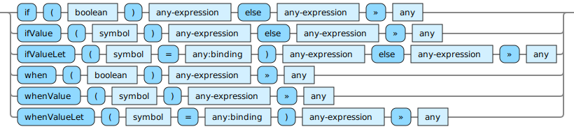

<!---
  This markdown file was generated. Do not edit.
  -->

# Jadeite reference: Control flow

Operators that control the flow of execution of the code.

#### [`cond`](halite_full-reference-j.md#cond)

Consider arguments pairwise as a predicate followed by an expression. For the first pair, if the predicate evaluates to true then evaluate the expression as the result otherwise consider the next pair. If none of the pairs have a predicate that evaluates to true, then the final argument is evaluated as the result.

#### [`if`](halite_full-reference-j.md#if)

If the first argument is true, then evaluate the second argument, otherwise evaluate the third argument.

#### [`ifValue`](halite_full-reference-j.md#ifValue)

Consider the value bound to the symbol. If it is a 'value', then evaluate the second argument. If instead it is 'unset' then evaluate the third argument.

#### [`ifValueLet`](halite_full-reference-j.md#ifValueLet)

If the binding value is a 'value' then evaluate the second argument with the symbol bound to binding. If instead, the binding value is 'unset', then evaluate the third argument without introducing a new binding for the symbol.

#### [`when`](halite_full-reference-j.md#when)

If the first argument is true, then evaluate the second argument, otherwise produce 'unset'.

#### [`whenValue`](halite_full-reference-j.md#whenValue)

Consider the value bound to the symbol. If it is a 'value', then evaluate the second argument. If instead it is 'unset' then produce unset.

#### [`whenValueLet`](halite_full-reference-j.md#whenValueLet)

If the binding value is a 'value' then evaluate the second argument with the symbol bound to binding. If instead, the binding value is 'unset', then produce 'unset'

---
