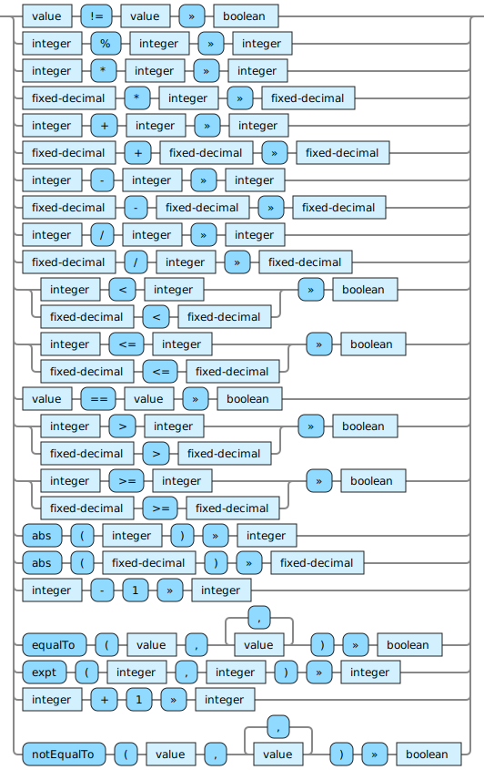

<!---
  This markdown file was generated. Do not edit.
  -->

# Jadeite reference: Integer operations

Operations that operate on integer values.

For basic syntax of this data type see: [`integer`](halite_basic-syntax-reference-j.md#integer)

#### [`!=`](halite_full-reference-j.md#_B_E)

Produces a false value if all of the values are equal to each other. Otherwise produces a true value.

#### [`%`](halite_full-reference-j.md#%)

Computes the mathematical modulus of two numbers. Use care if one of the arguments is negative.

#### [`*`](halite_full-reference-j.md#_S)

Multiply two numbers together.

#### [`+`](halite_full-reference-j.md#_A)

Add two numbers together.

#### [`-`](halite_full-reference-j.md#-)

Subtract one number from another.

#### [`/`](halite_full-reference-j.md#/)

Divide the first number by the second. When the first argument is an integer the result is truncated to an integer value. When the first argument is a fixed-decimal the result is truncated to the same precision as the first argument.

#### [`<`](halite_full-reference-j.md#_L)

Determine if a number is strictly less than another.

#### [`<=`](halite_full-reference-j.md#_L_E)

Determine if a number is less than or equal to another.

#### [`==`](halite_full-reference-j.md#_E_E)

Determine if values are equivalent. For vectors and sets this performs a comparison of their contents.

#### [`>`](halite_full-reference-j.md#_G)

Determine if a number is strictly greater than another.

#### [`>=`](halite_full-reference-j.md#_G_E)

Determine if a number is greater than or equal to another.

#### [`abs`](halite_full-reference-j.md#abs)

Compute the absolute value of a number.

#### [`dec`](halite_full-reference-j.md#dec)

Decrement a numeric value.

#### [`equalTo`](halite_full-reference-j.md#equalTo)

Determine if values are equivalent. For vectors and sets this performs a comparison of their contents.

#### [`expt`](halite_full-reference-j.md#expt)

Compute the numeric result of raising the first argument to the power given by the second argument. The exponent argument cannot be negative.

#### [`inc`](halite_full-reference-j.md#inc)

Increment a numeric value.

#### [`notEqualTo`](halite_full-reference-j.md#notEqualTo)

Produces a false value if all of the values are equal to each other. Otherwise produces a true value.

---
