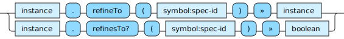

<!---
  This markdown file was generated. Do not edit.
  -->

# Jadeite reference: Spec-id operations

Operations that operate on spec identifiers.

For basic syntax of this data type see: [`symbol`](halite_basic-syntax-reference-j.md#symbol)

#### [`refineTo`](halite_full-reference-j.md#refineTo)

Attempt to refine the given instance into an instance of type, spec-id.

#### [`refinesTo?`](halite_full-reference-j.md#refinesTo_Q)

Determine whether it is possible to refine the given instance into an instance of type, spec-id.

---
