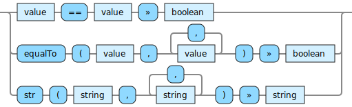

<!---
  This markdown file was generated. Do not edit.
  -->

# Jadeite reference: String operations

Operations that operate on string values.

For basic syntax of this data type see: [`string`](halite_basic-syntax-reference-j.md#string)

#### [`==`](halite_full-reference-j.md#_E_E)

Determine if values are equivalent. For vectors and sets this performs a comparison of their contents.

#### [`equalTo`](halite_full-reference-j.md#equalTo)

Determine if values are equivalent. For vectors and sets this performs a comparison of their contents.

#### [`str`](halite_full-reference-j.md#str)

Combine all of the input strings together in sequence to produce a new string.

---
