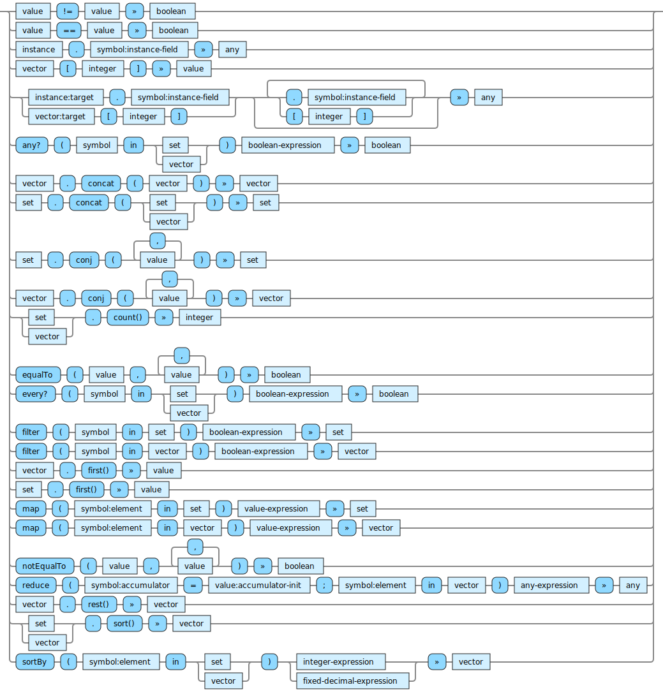

<!---
  This markdown file was generated. Do not edit.
  -->

# Jadeite reference: Vector operations

Operations that operate on vectors.

For basic syntax of this data type see: [`vector`](halite_basic-syntax-reference-j.md#vector)

#### [`!=`](halite_full-reference-j.md#_B_E)

Produces a false value if all of the values are equal to each other. Otherwise produces a true value.

#### [`==`](halite_full-reference-j.md#_E_E)

Determine if values are equivalent. For vectors and sets this performs a comparison of their contents.

#### [`ACCESSOR`](halite_full-reference-j.md#ACCESSOR)

Extract the given item from the first argument. If the first argument is an instance, extract the value for the given field from the given instance. For optional fields, this may produce 'unset'. Otherwise this will always produce a value. If the first argument is a vector, then extract the value at the given index in the vector. The index in this case is zero based.

#### [`ACCESSOR-CHAIN`](halite_full-reference-j.md#ACCESSOR-CHAIN)

A path of element accessors can be created by chaining together element access forms in sequence.

#### [`any?`](halite_full-reference-j.md#any_Q)

Evaluates to true if the boolean-expression is true when the symbol is bound to some element in the collection.

#### [`concat`](halite_full-reference-j.md#concat)

Combine two collections into one.

#### [`conj`](halite_full-reference-j.md#conj)

Add individual items to a collection.

#### [`count`](halite_full-reference-j.md#count)

Return how many items are in a collection.

#### [`equalTo`](halite_full-reference-j.md#equalTo)

Determine if values are equivalent. For vectors and sets this performs a comparison of their contents.

#### [`every?`](halite_full-reference-j.md#every_Q)

Evaluates to true if the boolean-expression is true when the symbol is bound to each the element in the collection.

#### [`filter`](halite_full-reference-j.md#filter)

Produce a new collection which contains only the elements from the original collection for which the boolean-expression is true. When applied to a vector, the order of the elements in the result preserves the order from the original vector.

#### [`first`](halite_full-reference-j.md#first)

Produce the first element from a vector.

#### [`map`](halite_full-reference-j.md#map)

Produce a new collection from a collection by evaluating the expression with the symbol bound to each element of the original collection, one-by-one. The results of evaluating the expression will be in the resulting collection. When operating on a vector, the order of the output vector will correspond to the order of the items in the original vector.

#### [`notEqualTo`](halite_full-reference-j.md#notEqualTo)

Produces a false value if all of the values are equal to each other. Otherwise produces a true value.

#### [`reduce`](halite_full-reference-j.md#reduce)

Evalue the expression repeatedly for each element in the vector. The accumulator value will have a value of accumulator-init on the first evaluation of the expression. Subsequent evaluations of the expression will chain the prior result in as the value of the accumulator. The result of the final evaluation of the expression will be produced as the result of the reduce operation. The elements are processed in order.

#### [`rest`](halite_full-reference-j.md#rest)

Produce a new vector which contains the same element of the argument, in the same order, except the first element is removed. If there are no elements in the argument, then an empty vector is produced.

#### [`sort`](halite_full-reference-j.md#sort)

Produce a new vector by sorting all of the items in the argument. Only collections of numeric values may be sorted.

#### [`sortBy`](halite_full-reference-j.md#sortBy)

Produce a new vector by sorting all of the items in the input collection according to the values produced by applying the expression to each element. The expression must produce a unique, sortable value for each element.

---
